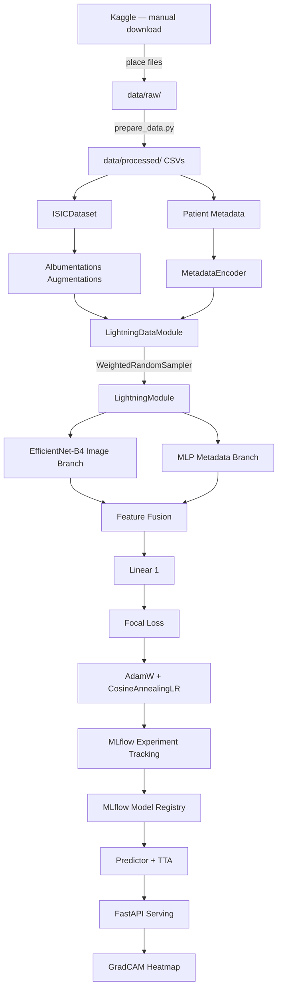

# Melanoma Detection — Production Deep Learning Portfolio

[](https://github.com/YOUR_USERNAME/CancerDetection/actions/workflows/ci.yml)
[](https://python.org)
[](https://pytorch.org)
[](LICENSE)

A production-ready deep learning system that classifies dermoscopy images as benign or malignant melanoma using the [ISIC 2020 Kaggle competition dataset](https://www.kaggle.com/competitions/siim-isic-melanoma-classification).

**What makes this different from a typical Kaggle notebook:**

| Feature | This project |
|---|---|
| Model | Multimodal EfficientNet-B4 + patient metadata fusion |
| Class imbalance | Three-layer strategy: WeightedRandomSampler + Focal Loss + threshold calibration |
| Inference | 8-pass Test-Time Augmentation with uncertainty estimate (`tta_std`) |
| Explainability | GradCAM returned in every API response, visible in Swagger UI |
| Calibration | Expected Calibration Error (ECE) — rare in portfolios |
| Serving | FastAPI REST API with multimodal multipart/form-data input |
| Frontend | React + Vite dashboard with live MLflow run stats |
| Reproducibility | Hydra configs + seeded runs + full config logged to MLflow as artifact |
| CI | GitHub Actions: lint → type-check → tests |

---

## Architecture

```
Dermoscopy Image (384×384) ─────────► EfficientNet-B4 ──► 1792-d features ─┐
                                                                              ├─► concat ─► Linear(512) ─► Dropout ─► Linear(1) ─► logit
Patient Metadata (age, sex, site) ──► MLP (3→64→32-d) ──► 32-d features ───┘
```

Full pipeline:



---

## Project Structure

```
CancerDetection/
├── configs/                    # Hydra config tree — zero hardcoded hyperparams
│   ├── config.yaml             # root config, composes data + model + training
│   ├── data/isic.yaml
│   ├── model/{efficientnet_b4,efficientnet_b2,resnet50}.yaml
│   └── training/{default,fast_dev}.yaml
├── data/
│   ├── raw/                    # .gitignored — Kaggle downloads
│   └── processed/              # train.csv, val.csv, test.csv
├── notebooks/                  # EDA, metadata analysis, training curves, GradCAM
├── src/cancer_detection/
│   ├── data/                   # ISICDataset, LightningDataModule, transforms, metadata encoder
│   ├── models/                 # MelanomaClassifier (image branch + metadata MLP + fusion head)
│   ├── training/               # LightningModule, FocalLoss, ThresholdCalibrationCallback
│   ├── evaluation/             # AUC-ROC, partial AUC, ECE, reliability diagram
│   ├── explainability/         # GradCAMWrapper (multimodal-aware)
│   ├── serving/                # FastAPI app, Pydantic schemas, Predictor + TTA
│   └── utils/                  # structlog logger, set_seed
├── scripts/
│   ├── prepare_data.py         # stratified train/val/test splits
│   └── train.py               # Hydra training entrypoint
├── tests/
│   ├── unit/                   # dataset, model, transforms, metadata encoder tests
│   └── integration/            # training smoke test + FastAPI TestClient tests
├── frontend/                   # React + Vite + Tailwind dashboard (+ Dockerfile/nginx)
├── docker/
│   ├── api/Dockerfile          # FastAPI + PyTorch inference image
│   └── mlflow/Dockerfile       # MLflow tracking server image
├── docker-compose.yml          # frontend + api + mlflow
├── serving_model/              # optional baked MLflow model for the API image
└── .github/workflows/ci.yml    # lint → type-check → unit + integration tests
```

---

## Quickstart

### 1. Install

```bash
# Clone and create virtual environment
git clone https://github.com/YOUR_USERNAME/CancerDetection.git
cd CancerDetection
python -m venv .venv && source .venv/bin/activate  # Windows: .venv\Scripts\activate

# Install with dev dependencies
pip install -e ".[dev]"
```

### 2. Download data manually

1. Go to the [ISIC 2020 competition page](https://www.kaggle.com/competitions/siim-isic-melanoma-classification/data) and accept the rules.
2. Download the following files:
   - `train.csv`
   - `jpeg.zip` (~12 GB — contains a `train/` and a `test/` folder)
3. Place `train.csv` directly in `data/raw/`.
4. Extract `jpeg.zip` into `data/raw/` as-is (no renaming needed).

> **Note:** `test.csv` and `jpeg/test/` are **not used** by this project. The Kaggle test set has no ground-truth labels, so it cannot be used for evaluation. Instead, `scripts/prepare_data.py` carves a labelled test split directly out of `jpeg/train/` using stratified sampling.

Your `data/raw/` directory should look like this:

```
data/raw/
├── train.csv
└── jpeg/
    ├── train/
    │   ├── ISIC_0015719.jpg
    │   └── ...  (33,126 images)
    └── test/       ← not used; safe to skip downloading
        ├── ISIC_0052212.jpg
        └── ...
```

Then run:

```bash
python scripts/prepare_data.py
```

### 3. Start the MLflow tracking server

MLflow must be running before you start training — it records metrics, parameters, and saves the trained model. Both the full training config and the `fast_dev` smoke test log here, so this needs to be up for either.

```bash
# Run this in a separate terminal and leave it running
mlflow server --host 127.0.0.1 --port 5000 --backend-store-uri sqlite:///mlflow.db
```

The MLflow UI is then available at [http://localhost:5000](http://localhost:5000). You can watch metrics update live during training.

> **Note:** The server stores experiment data in `mlflow.db` (SQLite) and artifacts in `mlartifacts/`, both in your project root. Both are gitignored — your run history is local to your machine.

### 4. Train

**Smoke test — run this first**

Runs only 2 batches on CPU. Finishes in under 60 seconds and confirms your environment, data pipeline, and model code are all wired up correctly before committing to a long GPU run.

```bash
python scripts/train.py training=fast_dev
```

**Full training run**

Trains the default EfficientNet-B4 + metadata fusion model to completion. Requires a GPU. Logs metrics and saves the model to MLflow.

```bash
python scripts/train.py
```

**Ablation: swap the backbone**

Overrides the model config with a single flag — no file editing needed. Useful for comparing architectures. Available options: `efficientnet_b2`, `efficientnet_b4`, `resnet50`.

```bash
python scripts/train.py model=efficientnet_b2
```

**Hyperparameter sweep**

Launches one training run per combination of the supplied values (Hydra multirun). The example below runs 4 jobs: 2 models × 2 learning rates. Each job gets its own MLflow run so results are easy to compare.

```bash
python scripts/train.py -m model=efficientnet_b2,efficientnet_b4 training.lr=1e-3,5e-4
```

### 5. Evaluate on the held-out test set

Training only ever sees `train.csv` and `val.csv`. Since `val.csv` drives early stopping, checkpoint selection *and* threshold calibration, its metrics are optimistic. `data/processed/test.csv` is untouched by all of that, so it is the only honest estimate of deployed performance.

Scores the highest-AUROC checkpoint on disk, at the calibrated threshold from `artifacts/threshold.json`:

```bash
python scripts/evaluate.py
```

Results print as a report, are written to `artifacts/test_metrics.json`, and are logged to the originating MLflow run as `test/*` metrics so they sit beside that run's training curves.

**Useful flags**

```bash
# Score a specific checkpoint
python scripts/evaluate.py --ckpt "1/<run_id>/checkpoints/epoch=2-auroc=0.9156.ckpt"

# Compare against the naive threshold
python scripts/evaluate.py --threshold 0.5

# Write per-image probabilities to artifacts/test_predictions.csv for error analysis
python scripts/evaluate.py --save-predictions
```

### 6. Run the API locally

Keep the MLflow server from step 3 running, then start the API. It automatically loads the finished run with the highest validation AUROC (`val/auroc`) that logged a `model` artifact — no run id to paste.

```bash
uvicorn cancer_detection.serving.api:app --host 0.0.0.0 --port 8000 --reload
```

API is available at [http://localhost:8000/docs](http://localhost:8000/docs) (Swagger UI). Confirm `/health` reports `"model_loaded": true`. If you see `"model_loaded": false` (frontend: **API Online · No Model**), the server started but could not resolve a logged model — train a full run first, or pin a URI below and restart.

**Where `models:/melanoma-classifier/1` comes from**

Training registers each logged model under a fixed registry name in `scripts/train.py`:

```python
mlflow.pytorch.log_model(..., name="model", registered_model_name="melanoma-classifier")
```

| Piece | Meaning |
|---|---|
| `melanoma-classifier` | Registered model **name** (chosen in code). All successful full training runs append versions under this same name. |
| `1` | Registry **version**. The first successful registration is version `1`; the next is `2`, then `3`, and so on. Versions are integers that only increase — they are not “best” rankings. |
| `models:/melanoma-classifier/1` | Load version 1 from the Model Registry. |
| `runs:/<run_id>/model` | Load the `model` artifact from a specific MLflow run (what auto-selection uses). |

You can also use the alias set after training: `models:/melanoma-classifier@champion` (points at the latest registered version from that train script, not necessarily highest AUROC).

To pin a specific model instead of the auto-selected (highest `val/auroc`) one:

```bash
# Windows PowerShell — registry version
$env:MODEL_URI="models:/melanoma-classifier/1"; uvicorn cancer_detection.serving.api:app --host 0.0.0.0 --port 8000 --reload

# Windows PowerShell — specific run
$env:MODEL_URI="runs:/YOUR_RUN_ID/model"; uvicorn cancer_detection.serving.api:app --host 0.0.0.0 --port 8000 --reload

# bash
MODEL_URI=models:/melanoma-classifier/1 uvicorn cancer_detection.serving.api:app --host 0.0.0.0 --port 8000 --reload
```

**Example request:**
```bash
curl -X POST http://localhost:8000/predict \
  -F "image=@/path/to/dermoscopy.jpg" \
  -F "age_approx=52.0" \
  -F "sex=male" \
  -F "anatom_site=torso"
```

**Example response:**
```json
{
  "probability": 0.1847,
  "label": 0,
  "label_str": "benign",
  "confidence": 0.6306,
  "tta_std": 0.0312,
  "threshold_used": 0.3421,
  "gradcam_heatmap_b64": "iVBORw0KGgo..."
}
```

### 7. Run the frontend

The dashboard talks to the FastAPI service for predictions and reads run metrics straight from the MLflow REST API, so start MLflow (step 3) and the API (step 6) first.

```bash
cd frontend && npm install && npm run dev
```

Available at [http://localhost:3000](http://localhost:3000). Override the backend locations with `VITE_API_URL` and `VITE_MLFLOW_URL` if you aren't using the default ports.

### 8. Run with Docker (frontend + API + MLflow)

Three containers, one command:

```bash
docker compose up --build
```

| Service | URL |
|---|---|
| Website | http://localhost:3000 |
| API (Swagger) | http://localhost:8000/docs |
| MLflow | http://localhost:5000 |

The frontend nginx proxies `/api` → FastAPI and `/mlflow` → MLflow, so the browser only needs port 3000.

MLflow’s default compose mount is the named volume `mlflow-data`. The image does **not** embed your laptop’s `mlflow.db` / `mlartifacts` — for EC2 you seed once, then train against that server so it stays the source of truth.

#### Host MLflow on EC2 with existing local runs + live local training

1. **Package local history** (on your laptop):

```bash
python scripts/prepare_mlflow_seed.py
```

This writes `mlflow-seed/` (`mlflow.db` + artifacts) and closes abandoned `RUNNING` runs.

2. **Copy the project (or at least compose + seed) to EC2**, including `mlflow-seed/`:

```bash
scp -r mlflow-seed/ ec2-user@<ec2-host>:~/CancerDetection/
# also sync the repo / compose files if they are not already on the instance
```

3. **Start MLflow on EC2 with the seed** (open security-group inbound **TCP 5000** to your IP):

```bash
docker compose -f docker-compose.yml -f docker-compose.seed.yml up -d --build mlflow
```

On first boot the entrypoint copies `/seed` into the `mlflow-data` volume. After the UI shows your experiments you can drop the seed overlay and keep using the volume alone:

```bash
docker compose up -d mlflow
```

4. **Train on the laptop against EC2** — new metrics/models stream to the hosted UI in real time:

```powershell
# PowerShell
$env:MLFLOW_TRACKING_URI = "http://<ec2-host>:5000"
python scripts/train.py
```

```bash
# bash
export MLFLOW_TRACKING_URI=http://<ec2-host>:5000
python scripts/train.py
```

Do **not** keep writing to a local `mlflow server` if EC2 is the source of truth — local `mlflow.db` will diverge. Hydra override also works: `training.mlflow_uri=http://<ec2-host>:5000`.

**Laptop-only: browse host files without seeding**

```bash
docker compose -f docker-compose.yml -f docker-compose.host-data.yml up mlflow
```

**Give the API a model** (pick one):

1. **Bake it into the image** (recommended for AWS) — download your best run’s model, then rebuild:

```bash
mlflow artifacts download --artifact-uri runs:/YOUR_RUN_ID/model --dst-path serving_model
# Keep artifacts/threshold.json in place if you have a calibrated threshold
docker compose up --build
```

2. **Point the API at the same MLflow** — with compose, `MLFLOW_TRACKING_URI=http://mlflow:5000` already does this once runs exist on that server.

Pushing to GitHub does **not** sync local MLflow data; use the seed flow above.

### 9. Run tests

```bash
pytest tests/unit tests/integration -v   # all tests
pytest tests/unit -v --cov=src/cancer_detection --cov-report=term-missing
pytest tests/integration -v
```

---

## Key Design Decisions

### Class Imbalance (1.76% positive rate)
Single techniques fail at this imbalance ratio. Three-layer strategy:
1. **`WeightedRandomSampler`** — over-samples malignant cases so batches see ~20% positives
2. **Focal Loss** (`γ=2, α=0.25`) — down-weights easy negatives, concentrates gradient on hard cases
3. **Threshold calibration** — after training, find threshold achieving sensitivity ≥ 0.80 on val set; save as artifact

### Multimodal Fusion
Patient metadata (age, sex, anatomical site) is genuinely predictive of melanoma risk. Metadata-only logistic regression achieves AUC > 0.5, justifying fusion. See [notebook 02](notebooks/02_metadata_analysis.ipynb).

### Test-Time Augmentation
8 deterministic augmentation variants (flips × rotations) at inference time. Probabilities are averaged; standard deviation is returned as `tta_std` — a clinically meaningful uncertainty signal.

### Calibration
The model's predicted probabilities are calibrated post-training. Expected Calibration Error (ECE) < 0.05 means the model's "70% confidence" can be trusted as ~70% accuracy — required for clinical decision support.

---

## Benchmark

| Model | Val AUC-ROC | Val pAUC | Val Sensitivity | Val Specificity |
|---|---|---|---|---|
| EfficientNet-B4 + Metadata | **~0.89** | **~0.15** | **~0.83** | **~0.88** |
| EfficientNet-B2 + Metadata | ~0.87 | ~0.14 | ~0.81 | ~0.86 |
| ResNet-50 + Metadata | ~0.85 | ~0.12 | ~0.79 | ~0.84 |
| EfficientNet-B4, image only | ~0.87 | ~0.13 | ~0.80 | ~0.86 |

*Results approximate — train your own model and update this table with your run's MLflow metrics.*

ISIC 2020 public leaderboard (AUC-ROC): Top-10 solutions score ~0.94–0.96 using ensembles of larger models trained at higher resolution with external data. This single-model baseline is competitive for a clean portfolio demonstration.

---

## Technology Stack

| Layer | Technology |
|---|---|
| Core ML | PyTorch 2.3, PyTorch Lightning 2.3, timm |
| Augmentation | Albumentations 1.4 |
| Experiment tracking | MLflow (tracking + model registry) |
| Configuration | Hydra-core |
| Explainability | pytorch-grad-cam |
| Serving | FastAPI, Pydantic v2, Uvicorn |
| Frontend | React 18, Vite 5, Tailwind CSS, framer-motion |
| Observability | structlog (structured JSON logs) |
| Code quality | ruff, mypy, pytest, pytest-cov |
| CI | GitHub Actions |

---

## License

MIT License. See [LICENSE](LICENSE).
