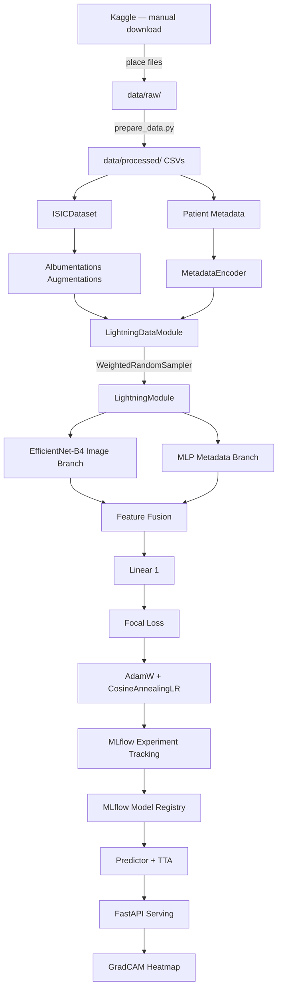
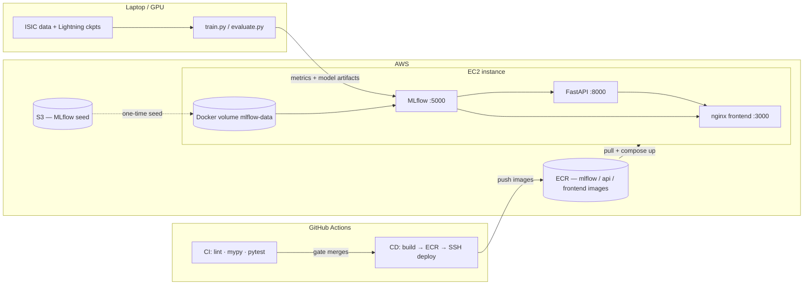
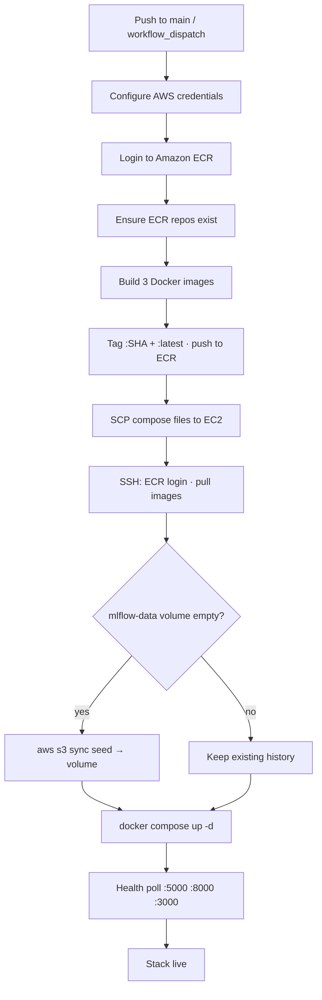

# Melanoma Detection — Production Deep Learning Portfolio

[](https://github.com/YOUR_USERNAME/CancerDetection/actions/workflows/ci.yml)
[](https://python.org)
[](https://pytorch.org)
[](https://fastapi.tiangolo.com)
[](https://react.dev)
[](https://www.docker.com)
[](https://aws.amazon.com)
[](https://mlflow.org)
[](LICENSE)

A production-ready multimodal deep learning system that classifies dermoscopy images as benign or malignant melanoma using the [ISIC 2020 Kaggle competition dataset](https://www.kaggle.com/competitions/siim-isic-melanoma-classification) — trained with PyTorch Lightning, tracked in MLflow, served with FastAPI + GradCAM, visualized in a React dashboard, and deployed to **AWS (EC2 + ECR + S3)** through a **GitHub Actions CI/CD** pipeline.

**Resume one-liner:** Built an end-to-end ML product (model → API → UI → cloud deploy) with experiment tracking, containerized multi-service infra, and automated ECR → EC2 delivery — not just a training notebook.

**What makes this different from a typical Kaggle notebook:**

| Feature | This project |
|---|---|
| Model | Multimodal EfficientNet-B4 + patient metadata fusion |
| Class imbalance | Three-layer strategy: WeightedRandomSampler + Focal Loss + threshold calibration |
| Inference | 8-pass Test-Time Augmentation with uncertainty estimate (`tta_std`) |
| Explainability | GradCAM returned in every API response, visible in Swagger UI |
| Calibration | Expected Calibration Error (ECE) — rare in portfolios |
| Serving | FastAPI REST API with multimodal multipart/form-data input |
| Frontend | React + Vite dashboard with live MLflow run stats |
| Reproducibility | Hydra configs + seeded runs + full config logged to MLflow as artifact |
| MLOps | MLflow tracking + Model Registry (`melanoma-classifier` / `@champion`) |
| Cloud | AWS EC2 hosting, ECR container registry, S3 experiment-history seed |
| Containers | Multi-service Docker Compose (API + MLflow + nginx frontend) |
| CI/CD | GitHub Actions: lint → type-check → tests → build/push ECR → deploy EC2 |

---

## Architecture

```
Dermoscopy Image (384×384) ─────────► EfficientNet-B4 ──► 1792-d features ─┐
                                                                              ├─► concat ─► Linear(512) ─► Dropout ─► Linear(1) ─► logit
Patient Metadata (age, sex, site) ──► MLP (3→64→32-d) ──► 32-d features ───┘
```

Full pipeline:



---

## Project Structure

```
CancerDetection/
├── configs/                    # Hydra config tree — zero hardcoded hyperparams
│   ├── config.yaml             # root config, composes data + model + training
│   ├── data/isic.yaml
│   ├── model/{efficientnet_b4,efficientnet_b2,resnet50}.yaml
│   └── training/{default,fast_dev}.yaml
├── data/
│   ├── raw/                    # .gitignored — Kaggle downloads
│   └── processed/              # train.csv, val.csv, test.csv
├── notebooks/                  # EDA, metadata analysis, training curves, GradCAM
├── src/cancer_detection/
│   ├── data/                   # ISICDataset, LightningDataModule, transforms, metadata encoder
│   ├── models/                 # MelanomaClassifier (image branch + metadata MLP + fusion head)
│   ├── training/               # LightningModule, FocalLoss, ThresholdCalibrationCallback
│   ├── evaluation/             # AUC-ROC, partial AUC, ECE, reliability diagram
│   ├── explainability/         # GradCAMWrapper (multimodal-aware)
│   ├── serving/                # FastAPI app, Pydantic schemas, Predictor + TTA
│   └── utils/                  # structlog logger, set_seed
├── scripts/
│   ├── prepare_data.py         # stratified train/val/test splits
│   └── train.py               # Hydra training entrypoint
├── tests/
│   ├── unit/                   # dataset, model, transforms, metadata encoder tests
│   └── integration/            # training smoke test + FastAPI TestClient tests
├── frontend/                   # React + Vite + Tailwind dashboard (+ Dockerfile/nginx)
├── docker/
│   ├── api/Dockerfile          # FastAPI + PyTorch inference image
│   ├── mlflow/Dockerfile       # MLflow tracking server image
│   ├── docker-compose.yml      # frontend + api + mlflow
│   ├── docker-compose.ecr.yml  # pull images from ECR
│   ├── docker-compose.ec2.yml  # EC2 volume / mount overlay
│   └── docker-compose.*.yml    # seed / host-data overlays
├── logs/                       # local train/eval capture (gitignored)
├── serving_model/              # optional baked MLflow model for the API image
└── .github/workflows/          # ci.yml + deploy.yml
```

---

## Quickstart

### 1. Install

```bash
# Clone and create virtual environment
git clone https://github.com/YOUR_USERNAME/CancerDetection.git
cd CancerDetection
python -m venv .venv && source .venv/bin/activate  # Windows: .venv\Scripts\activate

# Install with dev dependencies
pip install -e ".[dev]"
```

### 2. Download data manually

1. Go to the [ISIC 2020 competition page](https://www.kaggle.com/competitions/siim-isic-melanoma-classification/data) and accept the rules.
2. Download the following files:
   - `train.csv`
   - `jpeg.zip` (~12 GB — contains a `train/` and a `test/` folder)
3. Place `train.csv` directly in `data/raw/`.
4. Extract `jpeg.zip` into `data/raw/` as-is (no renaming needed).

> **Note:** `test.csv` and `jpeg/test/` are **not used** by this project. The Kaggle test set has no ground-truth labels, so it cannot be used for evaluation. Instead, `scripts/prepare_data.py` carves a labelled test split directly out of `jpeg/train/` using stratified sampling.

Your `data/raw/` directory should look like this:

```
data/raw/
├── train.csv
└── jpeg/
    ├── train/
    │   ├── ISIC_0015719.jpg
    │   └── ...  (33,126 images)
    └── test/       ← not used; safe to skip downloading
        ├── ISIC_0052212.jpg
        └── ...
```

Then run:

```bash
python scripts/prepare_data.py
```

### 3. MLflow tracking (hosted on EC2)

Training logs metrics, parameters, and model artifacts to the **EC2 stack** MLflow service. The default URI in `configs/training/*.yaml` is:

`http://18.219.3.159:5000`

With the full stack deployed (step 8), open [http://18.219.3.159:3000](http://18.219.3.159:3000) for the site (metrics via `/mlflow`) or [http://18.219.3.159:5000](http://18.219.3.159:5000) for the MLflow UI. You do **not** need a local `mlflow server` for normal training.

- **Laptop still trains** (GPU/CPU, data, Lightning checkpoints under `1/<run_id>/checkpoints/`).
- **EC2 stores** the MLflow DB + uploaded artifacts (same volume the hosted API and frontend use).
- Override with `MLFLOW_TRACKING_URI=http://localhost:5000` only if you intentionally run a local tracking server.

> **Note:** If the EC2 public IP changes (no Elastic IP), update `mlflow_uri` in the training configs and `DEFAULT_TRACKING_URI` in `src/cancer_detection/serving/model_uri.py`.

### 4. Train

**Smoke test — run this first**

Runs only 2 batches on CPU. Finishes in under 60 seconds and confirms your environment, data pipeline, and model code are all wired up correctly before committing to a long GPU run. Logs to the hosted MLflow experiment `melanoma-smoke`.

```bash
python scripts/train.py training=fast_dev
```

**Full training run**

Trains the default EfficientNet-B4 + metadata fusion model to completion. Requires a GPU. Streams metrics to EC2 and uploads the logged `model` artifact there. Top-3 AUROC Lightning checkpoints remain on your laptop under `1/<run_id>/checkpoints/`.

```bash
python scripts/train.py
```

**Ablation: swap the backbone**

Overrides the model config with a single flag — no file editing needed. Useful for comparing architectures. Available options: `efficientnet_b2`, `efficientnet_b4`, `resnet50`.

```bash
python scripts/train.py model=efficientnet_b2
```

**Hyperparameter sweep**

Launches one training run per combination of the supplied values (Hydra multirun). The example below runs 4 jobs: 2 models × 2 learning rates. Each job gets its own MLflow run so results are easy to compare.

```bash
python scripts/train.py -m model=efficientnet_b2,efficientnet_b4 training.lr=1e-3,5e-4
```

### 5. Evaluate on the held-out test set

Training only ever sees `train.csv` and `val.csv`. Since `val.csv` drives early stopping, checkpoint selection *and* threshold calibration, its metrics are optimistic. `data/processed/test.csv` is untouched by all of that, so it is the only honest estimate of deployed performance.

Scores the highest-AUROC checkpoint on disk, at the calibrated threshold from `artifacts/threshold.json`:

```bash
python scripts/evaluate.py
```

Results print as a report, are written to `artifacts/test_metrics.json`, and are logged to the originating MLflow run as `test/*` metrics so they sit beside that run's training curves.

**Useful flags**

```bash
# Score a specific checkpoint
python scripts/evaluate.py --ckpt "1/<run_id>/checkpoints/epoch=2-auroc=0.9156.ckpt"

# Compare against the naive threshold
python scripts/evaluate.py --threshold 0.5

# Write per-image probabilities to artifacts/test_predictions.csv for error analysis
python scripts/evaluate.py --save-predictions
```

### 6. Run the API locally

Start the API; it talks to the same hosted MLflow (`http://18.219.3.159:5000` by default) and loads the finished run with the highest validation AUROC (`val/auroc`) that logged a `model` artifact — no run id to paste.

```bash
uvicorn cancer_detection.serving.api:app --host 0.0.0.0 --port 8000 --reload
```

API is available at [http://localhost:8000/docs](http://localhost:8000/docs) (Swagger UI). Confirm `/health` reports `"model_loaded": true`. If you see `"model_loaded": false` (frontend: **API Online · No Model**), the server started but could not resolve a logged model — train a full run first, or pin a URI below and restart.

**Where `models:/melanoma-classifier/1` comes from**

Training registers each logged model under a fixed registry name in `scripts/train.py`:

```python
mlflow.pytorch.log_model(..., name="model", registered_model_name="melanoma-classifier")
```

| Piece | Meaning |
|---|---|
| `melanoma-classifier` | Registered model **name** (chosen in code). All successful full training runs append versions under this same name. |
| `1` | Registry **version**. The first successful registration is version `1`; the next is `2`, then `3`, and so on. Versions are integers that only increase — they are not “best” rankings. |
| `models:/melanoma-classifier/1` | Load version 1 from the Model Registry. |
| `runs:/<run_id>/model` | Load the `model` artifact from a specific MLflow run (what auto-selection uses). |

You can also use the alias set after training: `models:/melanoma-classifier@champion` (points at the latest registered version from that train script, not necessarily highest AUROC).

To pin a specific model instead of the auto-selected (highest `val/auroc`) one:

```bash
# Windows PowerShell — registry version
$env:MODEL_URI="models:/melanoma-classifier/1"; uvicorn cancer_detection.serving.api:app --host 0.0.0.0 --port 8000 --reload

# Windows PowerShell — specific run
$env:MODEL_URI="runs:/YOUR_RUN_ID/model"; uvicorn cancer_detection.serving.api:app --host 0.0.0.0 --port 8000 --reload

# bash
MODEL_URI=models:/melanoma-classifier/1 uvicorn cancer_detection.serving.api:app --host 0.0.0.0 --port 8000 --reload
```

**Example request:**
```bash
curl -X POST http://localhost:8000/predict \
  -F "image=@/path/to/dermoscopy.jpg" \
  -F "age_approx=52.0" \
  -F "sex=male" \
  -F "anatom_site=torso"
```

**Example response:**
```json
{
  "probability": 0.1847,
  "label": 0,
  "label_str": "benign",
  "confidence": 0.6306,
  "tta_std": 0.0312,
  "threshold_used": 0.3421,
  "gradcam_heatmap_b64": "iVBORw0KGgo..."
}
```

### 7. Run the frontend

The dashboard talks to the FastAPI service for predictions and reads run metrics straight from the MLflow REST API, so start MLflow (step 3) and the API (step 6) first.

```bash
cd frontend && npm install && npm run dev
```

Available at [http://localhost:3000](http://localhost:3000). Override the backend locations with `VITE_API_URL` and `VITE_MLFLOW_URL` if you aren't using the default ports.

### 8. Run with Docker (frontend + API + MLflow)

#### Local laptop stack

Three containers, one command (same wiring as EC2):

```bash
docker compose --project-directory . -f docker/docker-compose.yml up --build
```

| Service | URL |
|---|---|
| Website | http://localhost:3000 |
| API (Swagger) | http://localhost:8000/docs |
| MLflow | http://localhost:5000 |

The frontend nginx proxies `/api` → FastAPI and `/mlflow` → MLflow, so the browser only needs port 3000. The API auto-picks the finished run with highest `val/auroc` that logged a `model` artifact.

For a laptop-only MLflow that reads your host `mlflow.db` / `mlartifacts`:

```bash
docker compose --project-directory . \
  -f docker/docker-compose.yml -f docker/docker-compose.host-data.yml up mlflow
# then: MLFLOW_TRACKING_URI=http://localhost:5000 python scripts/train.py
```

#### Host full stack on EC2 (recommended)

Same three services on one instance, sharing Docker volume `mlflow-data`. Public host: `18.219.3.159`.

| Service | URL |
|---|---|
| Website | http://18.219.3.159:3000 |
| API (Swagger) | http://18.219.3.159:8000/docs |
| MLflow | http://18.219.3.159:5000 (also via site `/mlflow`) |

**Security group:** allow inbound TCP **3000**, **5000**, and **8000** from your IP (5000 is required for laptop training).

1. **Package + upload history once** (laptop; needs AWS CLI):

```bash
python scripts/prepare_mlflow_seed.py --s3 s3://YOUR_BUCKET/mlflow-seed
```

2. **GitHub secrets** (Settings → Secrets → Actions):  
   `AWS_*`, `EC2_HOST` (= `18.219.3.159`), `EC2_USER`, `EC2_SSH_KEY`, and  
   `MLFLOW_SEED_S3_URI` = `s3://YOUR_BUCKET/mlflow-seed`

3. **Deploy** — Actions → **Deploy stack** (or push to `main` when compose/Docker/app paths change).  
   Builds and pushes `mlflow`, `api`, and `frontend` images to ECR, copies `docker/docker-compose*.yml` to EC2, then  
   `docker compose --project-directory . -f docker/docker-compose.yml -f docker/docker-compose.ecr.yml -f docker/docker-compose.ec2.yml up -d`.  
   First boot: imports the S3 seed into volume `mlflow-data`. Later deploys **keep** that volume.

4. **Train on the laptop** — defaults already point at EC2 MLflow:

```bash
python scripts/train.py
```

Open [http://18.219.3.159:3000](http://18.219.3.159:3000) — run stats update live from MLflow.  
Do **not** keep a local `mlflow server` as source of truth after this; a local `mlflow.db` will diverge.

5. **After a better training run** — frontend metrics update immediately; predictions use the model loaded at API startup. Restart the API on EC2 to pick up the new best AUROC model:

```bash
ssh <user>@18.219.3.159
cd ~/cancer-detection
docker compose --project-directory . \
  -f docker/docker-compose.yml -f docker/docker-compose.ecr.yml \
  -f docker/docker-compose.ec2.yml restart api
```

**Download a run’s model artifact to the laptop** (optional):

```bash
mlflow artifacts download --artifact-uri runs:/YOUR_RUN_ID/model --dst-path serving_model
```

**Local Vite vs hosted frontend:** `npm run dev` defaults to the EC2 MLflow URL for metrics; the Docker/EC2 frontend build bakes `VITE_API_URL=/api` and `VITE_MLFLOW_URL=/mlflow` (nginx proxies) so the browser only needs port 3000.

**Bake a model into the API image** (optional offline fallback):

```bash
mlflow artifacts download --artifact-uri runs:/YOUR_RUN_ID/model --dst-path serving_model
# Keep artifacts/threshold.json in place if you have a calibrated threshold
docker compose --project-directory . -f docker/docker-compose.yml up --build
```

Pushing to GitHub does **not** sync laptop MLflow folders; use the seed flow above for history migration.

### 9. Run tests

```bash
pytest tests/unit tests/integration -v   # all tests
pytest tests/unit -v --cov=src/cancer_detection --cov-report=term-missing
pytest tests/integration -v
```

---

## Key Design Decisions

### Class Imbalance (1.76% positive rate)
Single techniques fail at this imbalance ratio. Three-layer strategy:
1. **`WeightedRandomSampler`** — over-samples malignant cases so batches see ~20% positives
2. **Focal Loss** (`γ=2, α=0.25`) — down-weights easy negatives, concentrates gradient on hard cases
3. **Threshold calibration** — after training, find threshold achieving sensitivity ≥ 0.80 on val set; save as artifact

### Multimodal Fusion
Patient metadata (age, sex, anatomical site) is genuinely predictive of melanoma risk. Metadata-only logistic regression achieves AUC > 0.5, justifying fusion. See [notebook 02](notebooks/02_metadata_analysis.ipynb).

### Test-Time Augmentation
8 deterministic augmentation variants (flips × rotations) at inference time. Probabilities are averaged; standard deviation is returned as `tta_std` — a clinically meaningful uncertainty signal.

### Calibration
The model's predicted probabilities are calibrated post-training. Expected Calibration Error (ECE) < 0.05 means the model's "70% confidence" can be trusted as ~70% accuracy — required for clinical decision support.

---

## Benchmark

| Model | Val AUC-ROC | Val pAUC | Val Sensitivity | Val Specificity |
|---|---|---|---|---|
| EfficientNet-B4 + Metadata | **~0.89** | **~0.15** | **~0.83** | **~0.88** |
| EfficientNet-B2 + Metadata | ~0.87 | ~0.14 | ~0.81 | ~0.86 |
| ResNet-50 + Metadata | ~0.85 | ~0.12 | ~0.79 | ~0.84 |
| EfficientNet-B4, image only | ~0.87 | ~0.13 | ~0.80 | ~0.86 |

*Results approximate — train your own model and update this table with your run's MLflow metrics.*

ISIC 2020 public leaderboard (AUC-ROC): Top-10 solutions score ~0.94–0.96 using ensembles of larger models trained at higher resolution with external data. This single-model baseline is competitive for a clean portfolio demonstration.

---

## Technology Stack

End-to-end stack spanning training, MLOps, API serving, frontend, containers, and AWS deployment — the kind of breadth employers look for in ML / MLOps / full-stack AI roles.

| Layer | Technologies |
|---|---|
| **Languages** | Python 3.11, TypeScript, Shell |
| **Deep Learning** | PyTorch 2.3, PyTorch Lightning 2.3, timm (EfficientNet-B4 / B2 / B0, ResNet-50) |
| **Data & Augmentation** | Albumentations, NumPy, Pandas, Pillow, OpenCV, scikit-learn |
| **Training metrics** | torchmetrics (AUROC, F1), custom partial AUC, ECE / reliability diagrams |
| **Configuration** | Hydra + OmegaConf (composable YAML; zero hardcoded hyperparameters) |
| **Experiment tracking** | MLflow Tracking, Model Registry, artifact store (SQLite + filesystem) |
| **Explainability** | pytorch-grad-cam (GradCAM heatmaps in every prediction) |
| **API / Serving** | FastAPI, Pydantic v2, Uvicorn, python-multipart |
| **Frontend** | React 18, Vite 5, TypeScript, Tailwind CSS, framer-motion, lucide-react |
| **Web / proxy** | nginx (SPA + reverse proxy for `/api` and `/mlflow`) |
| **Containers** | Docker, Docker Compose (multi-service overlays for local / ECR / EC2 / seed) |
| **Cloud (AWS)** | EC2, ECR, S3, IAM credentials, AWS CLI |
| **CI/CD** | GitHub Actions (CI quality gates + CD build/push/deploy) |
| **Observability** | structlog (JSON logs), Docker healthchecks, deploy-time health polling |
| **Code quality** | ruff, mypy, pytest, pytest-cov, Codecov |
| **Packaging** | hatchling (`pip install -e ".[dev]"`), Node 20 / npm |

---

## Cloud Architecture & DevOps

Training runs on a laptop GPU; the **source of truth for experiments and serving** lives on AWS. That split mirrors real ML teams: heavy compute locally or on a training box, durable tracking and inference in the cloud.



### What each AWS piece does

| Service | Role in this project |
|---|---|
| **Amazon EC2** | Single instance runs the full production stack: React/nginx frontend, FastAPI inference API, and MLflow tracking server. Security group opens TCP **3000 / 5000 / 8000**. Laptop training streams live to `:5000`. |
| **Amazon ECR** | Private registry for three images (`mlflow`, `api`, `frontend`). Images tagged with both `git SHA` and `latest`; scan-on-push enabled. EC2 pulls from ECR instead of building on the instance. |
| **Amazon S3** | One-time migration of local MLflow history (`mlflow.db` + artifacts) via `scripts/prepare_mlflow_seed.py --s3 …`. First EC2 boot syncs the seed into a named Docker volume so run history survives redeploys. |
| **IAM + AWS CLI** | GitHub Actions assumes credentials to push to ECR; the EC2 host uses AWS CLI for ECR login and S3 sync during deploy. |
| **Docker Compose overlays** | Same base compose file, environment-specific layers: `ecr.yml` (pre-built images), `ec2.yml` (persistent volume, no laptop binds), `seed.yml` (first-boot import), `host-data.yml` (local debugging). |

### Why this design matters (resume talking points)

- **Separation of train vs serve** — GPU training stays on the laptop; EC2 stays lean (CPU inference + tracking), which is cost-aware and realistic.
- **Immutable container deploys** — app code ships as ECR images, not `git pull` on the server; redeploys are repeatable.
- **Persistent experiment history** — named volume `mlflow-data` keeps SQLite + artifacts across deploys; S3 seed handles the cold-start migration.
- **Model promotion path** — training logs to MLflow, registers `melanoma-classifier`, sets `@champion`; the API auto-loads the finished run with highest `val/auroc` (or a pinned `MODEL_URI`).
- **Single browser entrypoint** — nginx on `:3000` proxies `/api` and `/mlflow`, so users hit one origin while services stay decoupled.

Public stack (example host): [http://18.219.3.159:3000](http://18.219.3.159:3000) · API docs `:8000/docs` · MLflow `:5000`.

---

## CI/CD Pipeline

Two GitHub Actions workflows gate quality and ship the stack automatically.

### Continuous Integration (`.github/workflows/ci.yml`)

Runs on every push/PR to `main` / `develop`:

1. **Checkout** + Python 3.11 (pip cache)
2. Install CPU PyTorch + `pip install -e ".[dev]"`
3. **Lint** — `ruff check` + `ruff format --check` on `src/`, `tests/`, `scripts/`
4. **Type-check** — `mypy` on the package
5. **Unit tests** — `pytest tests/unit` with coverage XML
6. **Integration tests** — training smoke + FastAPI `TestClient` flows
7. **Coverage upload** — Codecov

### Continuous Deployment (`.github/workflows/deploy.yml`)

Triggered on `main` when deploy-relevant paths change (`docker/`, `frontend/`, `src/`, …), or manually via **workflow_dispatch**:



**Deploy job highlights:**

- Builds **MLflow**, **API**, and **frontend** images in CI (frontend baked with `VITE_API_URL=/api`, `VITE_MLFLOW_URL=/mlflow`)
- Pushes to ECR, then SCPs compose overlays and SSHs into EC2
- Creates/preserves Docker volume `mlflow-data`; imports from S3 **only** on first boot
- Waits until all three services pass health checks (fail-fast with container logs if not)
- Secrets: `AWS_ACCESS_KEY_ID`, `AWS_SECRET_ACCESS_KEY`, `AWS_REGION`, `EC2_HOST`, `EC2_USER`, `EC2_SSH_KEY`, `MLFLOW_SEED_S3_URI`

### Local → cloud training loop

1. Deploy stack (Actions) → MLflow live on EC2
2. `python scripts/train.py` on laptop → logs metrics/models to hosted MLflow
3. Frontend metrics update live; `docker compose … restart api` on EC2 to reload the best AUROC model for predictions

---

## License

MIT License. See [LICENSE](LICENSE).
