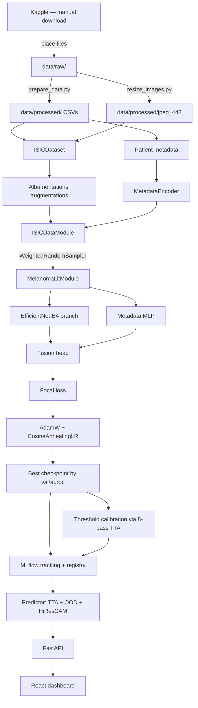
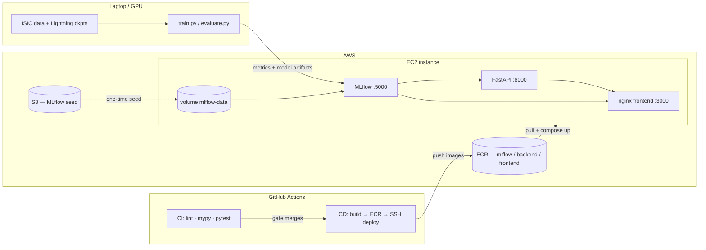
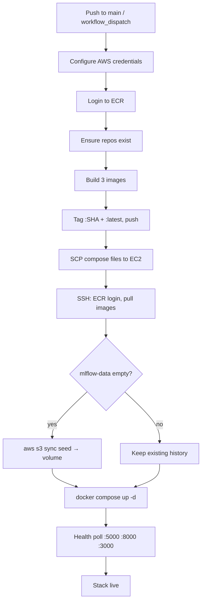

# Melanoma Detection — Design, Training, and Deployment of a Multimodal Classifier

[](https://github.com/MuhammadNisarWCSS/Melanoma-Detection/actions/workflows/ci.yml)
[](https://python.org)
[](https://pytorch.org)
[](https://fastapi.tiangolo.com)
[](https://react.dev)
[](https://www.docker.com)
[](https://aws.amazon.com)
[](https://mlflow.org)
[](LICENSE)

A multimodal deep learning system that classifies dermoscopy images as benign or malignant melanoma
from the [ISIC 2020](https://www.kaggle.com/competitions/siim-isic-melanoma-classification)
dataset: an EfficientNet-B4 image branch fused with a patient-metadata MLP, trained with PyTorch
Lightning under Hydra configs, tracked in MLflow, served by FastAPI with test-time augmentation,
out-of-distribution gating and saliency overlays, consumed by a React dashboard, and shipped to AWS
through GitHub Actions.

**Live stack:** [http://3.18.225.100:3000](http://3.18.225.100:3000) · API docs
[`:8000/docs`](http://3.18.225.100:8000/docs) · MLflow [`:5000`](http://3.18.225.100:5000)

> **Not a medical device.** Research and portfolio demonstration only — see
> [Model card](#model-card--limitations).

---

## What this project actually demonstrates

The interesting part of this repository is not the model — it is the sequence of measurements that
corrected it. An early version of this project reported **0.9355 test AUROC**. That number was
wrong: the split was per-image, so 1,656 of 1,657 test images shared a patient with training, and
separately the model being served to the website was not the checkpoint the metrics described. Both
failures were found by auditing the project's own results, and both are now enforced by tests and
by code. The honest, patient-disjoint number is **0.9069**.

| | This project |
|---|---|
| **Model** | EfficientNet-B4 image branch + patient-metadata MLP → fusion head → single logit |
| **Splits** | Patient-grouped `StratifiedGroupKFold` — no `patient_id` shared across train/val/test |
| **Leakage guard** | `tests/unit/test_patient_leakage.py` fails CI if any patient appears in two splits |
| **Imbalance** | Oversampling at 15% positive draw rate + focal loss (γ=2, α=0.5) + threshold calibration |
| **Inference** | 8 deterministic dihedral TTA passes; dispersion returned as `tta_std` |
| **OOD guard** | Mahalanobis distance on PCA-projected backbone embeddings; unreliable inputs flagged |
| **Explainability** | HiResCAM overlay returned with every prediction |
| **Reproducibility** | Hydra config tree, seeded runs, full config logged to MLflow |
| **MLOps** | MLflow tracking + registry (`melanoma-classifier` / `@champion`); **best** checkpoint logged |
| **Deployment** | Docker Compose (nginx + FastAPI + MLflow) on EC2, images from ECR, CI/CD in Actions |

---

## Design process

### 1. Framing: two numbers decide almost everything

ISIC 2020's training set is **33,126 dermoscopy images from 2,056 patients**, of which **584 are
malignant (1.76%)**. Those two facts — heavy per-patient clustering, extreme class imbalance —
drive nearly every design decision below.

The clustering matters because a patient contributes a median of ~12 images of their own skin, often
of the same lesion under slightly different framing. Any split that treats images as independent
puts nearly every patient on both sides of the boundary, and the model can score well by recognising
skin rather than by recognising melanoma.

`scripts/prepare_data.py` therefore splits with `StratifiedGroupKFold` grouped on `patient_id`
(defaults: 5% test, 15% val, seed 42), keeps `patient_id` in the output CSVs, and asserts disjoint
patient sets at split time:

| Split | Images | Malignant | Patients |
|---|---|---|---|
| train | 26,224 | 460 | 1,628 |
| val | 5,245 | 94 | 326 |
| test | 1,657 | 30 | 102 |

The Kaggle `test/` images are unused — they carry no labels, so the held-out set is carved from the
labelled training data instead.

### 2. Architecture: image branch plus metadata, because metadata carries signal

```
Dermoscopy image (384×384) ────► EfficientNet-B4 ──► 1792-d ─┐
                                                              ├─► concat ─► Linear(512) ─► ReLU
Metadata (age, sex, site) ─────► MLP 3→64→32 ──────► 32-d ───┘        └─► Dropout(0.5) ─► Linear(1)
```

Age, sex and anatomical site are genuinely predictive of melanoma risk — a metadata-only logistic
regression clears AUC 0.5 by a useful margin ([notebook 02](notebooks/02_metadata_analysis.ipynb)),
which is what justifies fusing them rather than treating this as a pure vision problem.
`MetadataEncoder` (`src/cancer_detection/data/metadata.py`) reduces the three fields to a 3-vector
with an explicit sentinel for missing values, so a request without metadata degrades rather than
crashes.

Backbone choice is a config, not a constant: `configs/model/` ships `efficientnet_b0`, `b2`, `b4`
and `resnet50`, swappable with `python scripts/train.py model=resnet50`. B4 at 384px is the default
— the accuracy/throughput balance that fits a single GPU.

**Why there is an image cache.** Raw ISIC JPEGs run up to 6000×4000 and cost ~300 ms of CPU each to
decode, which starves the GPU if it happens every epoch. `scripts/resize_images.py --size 448`
builds `data/processed/jpeg_448` once; `configs/data/isic.yaml` points there, and a single-process
loader then sustains ~320 samples/s. `num_workers: 0` is deliberate — Windows spawn deadlocked
while pickling the dataset to workers.

### 3. Imbalance: three layers, each correcting a specific failure

At 1.76% prevalence, no single technique works. Each of the three layers below was added because the
previous configuration failed in a way that could be named.

**Oversampling — `positive_sample_rate: 0.15`, not 50/50.** A `WeightedRandomSampler` at the naive
50/50 setting draws each of the ~460 training positives roughly 28× per epoch while leaving ~40% of
negatives unseen; the model memorises the positive set inside the first epoch. Dropping to 15% keeps
meaningful oversampling (~8.5×) while covering ~86% of negatives per epoch.

**Focal loss — γ=2, `focal_alpha: 0.5`, not the RetinaNet default 0.25.** α is a second imbalance
correction stacked on top of a batch the sampler has already rebalanced. At 0.5 it is neutral (a
uniform ×0.5 scale); at 0.25 it would bias the loss ~3:1 toward negatives and squash every predicted
probability toward zero.

**Threshold calibration — after training, not during.** `src/cancer_detection/training/threshold.py`
reloads the deployable weights, runs the validation split through **the same 8-pass TTA average the
API uses**, and picks the highest threshold that still reaches sensitivity ≥ 0.80. The result lands
in `artifacts/threshold.json` and on the MLflow run. Calibrating any other way — on raw single-pass
logits, or on the final epoch's weights — produces a threshold the served model does not honour.

### 4. The audit that changed the design

**Symptom.** The deployed site classified images from the training set correctly but called
web-sourced melanomas benign.

**Finding 1 — patient leakage.** `prepare_data.py` originally dropped `patient_id` and called a
per-image `train_test_split`. Measured on those CSVs: **1,656 / 1,657 test images**, including
**all 29 malignant ones**, shared a patient with training. The 0.9355 test AUROC was not a held-out
number.

**Finding 2 — the wrong weights were deployed.** `scripts/train.py` called
`mlflow.pytorch.log_model(lit_module.model)` after `fit()`. Lightning leaves the **final** epoch in
memory, not the best checkpoint. The run peaked at epoch 2 (val AUROC 0.922, train 0.983) and ended
at epoch 7 (val 0.912, train 0.995) — the site served epoch 7 while the metrics advertised epoch 2.
`scripts/diagnose.py` quantified the gap on held-out images at a fixed threshold:

| Model scored | Median malignant prob (test) | Sensitivity | Specificity |
|---|---|---|---|
| Best checkpoint (`epoch=2-auroc=0.9220`) | 0.351 | 0.966 | 0.750 |
| The artifact actually being served | 0.201 | 0.759 | 0.850 |

**Finding 3 — non-deterministic "deterministic" TTA.** `A.RandomRotate90(p=1.0)` still samples the
rotation count `k`, so identical uploads returned different probabilities on every request, and
`tta_std` measured the augmentation's randomness rather than the model's uncertainty.

**Finding 4 — squashed geometry at serve time.** ISIC images are ~3:2. Validation and serving used
`A.Resize(size, size)`, which distorts them relative to training's `RandomResizedCrop` — a
train/serve mismatch invisible in every metric computed with the same broken transform.

**Fixes, each now enforced by code:**

| Finding | Fix | Enforced in |
|---|---|---|
| Patient leakage | `StratifiedGroupKFold` on `patient_id`; assert disjoint sets at split time | `scripts/prepare_data.py`, `tests/unit/test_patient_leakage.py` (fails CI) |
| Wrong weights served | Reload `best_model_path` into a fresh module before `log_model`; calibrate the threshold on those weights | `scripts/train.py`, `training/threshold.py` |
| Non-reproducible TTA | Fixed `np.rot90(k=…)` lambdas for all 8 dihedral views | `_rot90` / `get_tta_transforms` in `data/transforms.py` |
| Squashed geometry | `SmallestMaxSize` + `CenterCrop` for val/TTA/serving | `_to_square` in `data/transforms.py` |
| Soft probabilities | `focal_alpha: 0.5` | `configs/training/default.yaml` |
| Domain brittleness | JPEG-compression, downscale and blur augmentation at train time; OOD gate at serve time | `get_train_transforms`, `serving/ood.py` |

`scripts/diagnose.py` remains in the repo as the standing check: it scores train images
(memorisation ceiling), held-out test images, the *same* test images re-encoded to look web-sourced,
and any loose files you pass it. On the current best checkpoint the degraded group tracks the clean
one (median malignant 0.365 vs 0.351), i.e. the acquisition-fingerprint sensitivity that motivated
the compression augmentation no longer shows up in this measurement. The train-vs-test gap (median
malignant 0.914 vs 0.351) is still large, and is exactly the gap a leaked split would have hidden.

### 5. Serving: turning a checkpoint into an answer

- **TTA.** Eight dihedral symmetries of the square; probabilities averaged, standard deviation
  returned as `tta_std`. Index 0 is the identity, so `Predictor` reuses that pass for the saliency
  map instead of running a ninth forward.
- **OOD gate.** The model is a *dermoscopy* classifier. `serving/ood.py` caches backbone embeddings
  for a sample of training images, PCA-projects them (1792-d is far too high for a stable covariance
  at this sample size), and flags uploads past the 99th percentile of Mahalanobis distance. The
  percentile is calibrated on a **held-out** slice of the sample — fitting mean, precision and
  threshold on the same data compresses in-sample distances and would trip real inputs far more
  often than the intended 1%. The UI then warns instead of confidently saying "benign".
- **HiResCAM, not GradCAM.** GradCAM globally averages gradients, which produced hotspots that did
  not track the lesion; HiResCAM preserves spatial gradients. The target layer is EfficientNet's
  `bn2` rather than `conv_head`, whose 1×1 border cells generated systematic top-right artefacts.
  `_ImageOnlyWrapper` fixes the metadata tensor so gradients flow through the image alone.
- **Degrade, don't crash.** The model loads in a background thread from FastAPI's `lifespan` (a
  blocking load made Docker healthchecks fail). `/health` stays 200 with `model_loaded: false`;
  prediction endpoints return 503 until the model is up.

### How each number is calculated

Everything below happens in `Predictor.predict` (`serving/predictor.py`) for one uploaded photo.

**Probability.** The photo is centre-cropped to a square and resized to 384×384. The age, sex and
site are encoded into a 3-number vector. The image goes through EfficientNet-B4 to give a 1,792-number
summary, the metadata goes through a small MLP to give 32 numbers, and the fusion head turns the
two into a single logit. A sigmoid converts the logit to a value between 0 and 1. That is done for
8 flipped/rotated copies of the photo (test-time augmentation), and the 8 values are averaged. The
average is the probability shown on the gauge. It is a ranking score, not a literal chance of
cancer: focal loss and oversampling push the raw values around, and the test-set ECE is 0.072.

**Cutoff and verdict.** `label = 1` if `probability ≥ threshold`, else 0. The threshold (currently
0.2348, in `artifacts/threshold.json`) is the highest value that still catches at least 80% of
melanomas on the validation split, using the same 8-pass average as the API. It sits well below 0.5
on purpose, since missing a melanoma is worse than a false alarm.

**Confidence (API only, no longer shown in the UI).** `confidence = |p − t| / max(t, 1 − t)`, the
distance from the cutoff scaled to 0–1. It is not a probability of being right, and it is lopsided:
with `t = 0.2348` a benign result can never score above 0.31, because `p` cannot fall further than
0.2348 below the cutoff, while a malignant one can reach 1.0. A confidence of 33% means the score
was about 0.49 (a malignant call), whereas the same 33% could never occur on a benign call. The
field is still in the response for API users, but the site no longer displays it because it reads as
"33% sure", which it isn't.

**View agreement (`tta_std`).** The population standard deviation of the 8 probabilities. If a
flipped photo gets a very different score, the model is reacting to orientation rather than the
lesion, which is a sign of an unstable prediction. The site shows it inside the collapsed details,
and shows a warning when it exceeds 0.10. That cutoff is a judgement call, not a calibrated value,
so treat the warning as a hint.

**Out-of-distribution flag.** The base view's 1,792-number summary is compared with a cloud of
training-image summaries using Mahalanobis distance after PCA. Past the 99th percentile of a
held-out slice, `out_of_distribution` is true and the UI warns that the label is unreliable.

**Heatmap (HiResCAM).** The model is run once more on the base view with gradients on. At the last
convolutional layer (`bn2`, a 12×12 grid of features), each cell's activation is multiplied by the
gradient of the predicted class's logit with respect to that activation, summed over channels, and
negative values are dropped. High values mark cells that pushed the score toward the **predicted**
class (toward malignant for a malignant call, toward benign for a benign call). The outer ring of
cells is zeroed because it carries a padding artifact, outliers are clipped, and the map is upsampled
and overlaid on the photo. Metadata is held fixed so the map reflects the image alone. It shows what
the model responded to, not where the disease is, and it is computed on one view only.

---

## Results

All numbers below come from `artifacts/test_metrics.json` (`python scripts/evaluate.py`), on the
patient-disjoint test split: 1,657 images, 30 malignant, 1.81% prevalence, at the calibrated
threshold 0.2348. Confidence intervals are bootstrap.

| Metric | Value | 95% CI |
|---|---|---|
| Test AUROC | **0.9069** | 0.863 – 0.949 |
| Test pAUC | 0.6908 | 0.566 – 0.862 |
| Sensitivity | 0.767 (23/30) | 0.600 – 0.900 |
| Specificity | 0.905 | 0.891 – 0.919 |
| PPV / NPV | 0.129 / 0.995 | — |
| F1 | 0.221 | — |
| ECE | 0.072 | — |
| Val AUROC (model selection) | 0.9252 | — |

**Before vs after the leakage fix.** The drop is the correct outcome, not a regression:

| Split construction | Test AUROC | Sensitivity | Specificity | Status |
|---|---|---|---|---|
| Image-level split (patients shared) | 0.9355 | 0.966 | 0.785 | Inflated — do not cite |
| Patient-grouped `StratifiedGroupKFold` | **0.9069** | 0.767 | 0.905 | Held out |

Two caveats worth stating plainly. **PPV is 0.080** — at 1.8% prevalence and a sensitivity-first
operating point, 155 of 178 flagged images are false positives; that is the deliberate trade, not a
bug. **ECE is 0.072**, which is acceptable but not something to lean on: probabilities here live far below
0.5 by construction (the operating threshold is 0.23), so ranking metrics (AUROC, pAUC) describe this
model better than a single calibration number would. With only 30 positives, every interval above is
wide; sensitivity could plausibly be anywhere from 0.60 to 0.90.

For context, top-10 ISIC 2020 leaderboard solutions score ~0.94–0.96 AUC using ensembles of larger
models, higher resolution and external data. This project prioritises one honest single-model
baseline over leaderboard chasing.

### Subgroup performance

`python scripts/subgroup_analysis.py` splits the test predictions by sex, age and site
(`artifacts/subgroup_metrics.json`). The subgroups are tiny, so read these as "where the model is
unproven", not as estimates.

| Subgroup | Images | Malignant | Sensitivity | Specificity | AUROC |
|---|---|---|---|---|---|
| Female | 833 | 12 | 0.67 | 0.93 | 0.87 |
| Male | 824 | 18 | 0.83 | 0.88 | 0.93 |
| Age < 40 | 429 | 5 | **0.40** | 0.94 | 0.74 |
| Age 40–59 | 941 | 7 | 0.71 | 0.92 | 0.94 |
| Age 60+ | 287 | 18 | 0.89 | 0.80 | 0.89 |
| Lower extremity | 446 | 5 | **0.40** | 0.91 | 0.73 |
| Torso | 818 | 8 | 0.75 | 0.91 | 0.94 |
| Upper extremity | 244 | 11 | 0.91 | 0.85 | 0.91 |
| Head / neck | 87 | 6 | 0.83 | 0.91 | 0.96 |

The weak spots are young patients and lower-limb lesions (2 of 5 malignant caught in each). Older
patients get the best sensitivity but the worst specificity, which is what a model leaning on age
would do. Palms/soles and oral/genital sites have no malignant test cases at all, so the model is
untested there.

---

## Architecture



**Config flow (Hydra).** `configs/config.yaml` composes `data/isic` + `model/efficientnet_b4` +
`training/default`. Nothing is hardcoded: `scripts/train.py` is `@hydra.main`-decorated and every
component downstream takes a `DictConfig` slice. `scripts/evaluate.py` re-composes the same tree via
`initialize_config_dir` and forwards `--override` strings, so evaluation cannot silently drift from
training.

**MLflow contract between training and serving.** Training logs the model artifact under the name
`model`, registers it as `melanoma-classifier` (alias `@champion`), and logs the metric `val/auroc`.
`serving/model_uri.resolve_model_uri()` resolves, in order: the `MODEL_URI` env var → the FINISHED
run with the highest `val/auroc` that has a `model` artifact. Renaming either the artifact or the
metric key breaks resolution silently, so both are fixed points of the design. Lightning checkpoints
stay local under `1/<run_id>/checkpoints/epoch={n}-auroc={val/auroc}.ckpt`; `evaluate.py` parses
that filename to find the best one.

**API surface.** `GET /health` (liveness + `model_loaded`), `GET /metadata` (accepted metadata
values), `GET /test-metrics` (the held-out results the dashboard renders), `POST /predict`
(multipart image + metadata fields). The app sets `root_path="/api"` because nginx proxies
`/api` → FastAPI and `/mlflow` → MLflow, so the browser only ever needs port 3000.

---

## Technology stack

**Modelling.** PyTorch 2.3 with PyTorch Lightning 2.3 for the training loop (checkpointing, early
stopping, mixed precision, `val_check_interval=0.25`), timm for pretrained backbones, torchmetrics
for AUROC/F1 plus a custom partial-AUC and ECE implementation in `evaluation/`. Albumentations
handles augmentation because the geometry decisions above (`SmallestMaxSize` + `CenterCrop`, fixed
`np.rot90` lambdas via `A.Lambda`) need transform-level control that torchvision's pipeline makes
awkward.

**Configuration and tracking.** Hydra + OmegaConf give composable YAML with CLI overrides and
multirun sweeps (`-m model=b2,b4 training.lr=1e-3,5e-4`) with zero hardcoded hyperparameters. MLflow
provides tracking, the model registry, and the artifact store (SQLite + filesystem), and is the
single interface between the training laptop and the serving host.

**Serving.** FastAPI + Pydantic v2 + Uvicorn, with `python-multipart` for image upload; pytorch-
grad-cam supplies the HiResCAM implementation; OOD detection is hand-written NumPy (SVD-based PCA
plus a pseudo-inverse covariance) to avoid a SciPy dependency in the inference image. structlog
emits JSON logs.

**Frontend.** React 18 + TypeScript + Vite 5 + Tailwind, with framer-motion and lucide-react. It
talks to FastAPI for predictions and reads run metrics straight from the MLflow REST API, so the
dashboard reflects real experiment history rather than a hardcoded table.

**Infrastructure.** Docker Compose with environment overlays, nginx as SPA host and reverse proxy,
AWS EC2 / ECR / S3, and GitHub Actions for both quality gates and deployment. Quality tooling: ruff
(lint + format), mypy, pytest with coverage to Codecov. Packaging via hatchling
(`pip install -e ".[dev]"`), Python 3.11, Node 20.

| Layer | Technologies |
|---|---|
| Languages | Python 3.11, TypeScript, Shell |
| Deep learning | PyTorch 2.3, Lightning 2.3, timm (EfficientNet-B0/B2/B4, ResNet-50) |
| Data & augmentation | Albumentations (<2.0), NumPy, Pandas, Pillow, OpenCV-headless, scikit-learn |
| Metrics | torchmetrics, custom partial AUC, ECE + reliability diagrams |
| Config | Hydra 1.3 + OmegaConf |
| Tracking | MLflow ≥2.14 (tracking, registry, artifacts) |
| Explainability | pytorch-grad-cam (HiResCAM) |
| Backend | FastAPI ≥0.111, Pydantic v2, Uvicorn, python-multipart |
| Frontend | React 18.3, Vite 5, TypeScript 5.4, Tailwind 3.4, framer-motion, lucide-react |
| Proxy | nginx (SPA + `/api`, `/mlflow` reverse proxy) |
| Containers | Docker, Docker Compose overlays (local / ECR / EC2 / seed / host-data) |
| Cloud | AWS EC2, ECR, S3, IAM, AWS CLI |
| CI/CD | GitHub Actions |
| Quality | ruff, mypy, pytest, pytest-cov, Codecov |

---

## Quickstart

### Install

```bash
git clone https://github.com/MuhammadNisarWCSS/Melanoma-Detection.git
cd Melanoma-Detection
python -m venv .venv && source .venv/bin/activate   # Windows: .venv\Scripts\activate
pip install -e ".[dev]"
```

### Data (one-time, manual)

Accept the rules on the [ISIC 2020 competition page](https://www.kaggle.com/competitions/siim-isic-melanoma-classification/data),
then download `train.csv` and `jpeg.zip` (~12 GB) into `data/raw/`:

```
data/raw/
├── train.csv
└── jpeg/
    ├── train/          # 33,126 images — everything this project uses
    │   └── ISIC_0015719.jpg …
    └── test/           # unlabelled; safe to skip downloading
```

The Kaggle test set has no ground-truth labels, so it cannot be used for evaluation — the held-out
test split is carved out of `jpeg/train/` with patient grouping instead.

```bash
python scripts/prepare_data.py         # patient-grouped train/val/test CSVs (--overwrite to redo)
python scripts/resize_images.py --size 448   # build the image cache the configs expect (required)
```

### Train

```bash
python scripts/train.py training=fast_dev    # 2-batch CPU smoke test, <60s — run this first
python scripts/train.py                      # full run (GPU)
python scripts/train.py model=efficientnet_b2 training.lr=1e-4                     # overrides
python scripts/train.py -m model=efficientnet_b2,efficientnet_b4 training.lr=1e-3,5e-4  # sweep
```

Training streams metrics to the hosted MLflow on EC2 by default (`mlflow_uri` in
`configs/training/*.yaml`); override with `MLFLOW_TRACKING_URI` rather than editing the configs.
Lightning keeps the top-3 AUROC checkpoints locally under `1/<run_id>/checkpoints/`. At the end of a
run, `train.py` reloads the **best** checkpoint before logging the model, calibrates the threshold on
it, and registers the result.

### Evaluate

Training only ever sees `train.csv` and `val.csv`, and `val.csv` drives early stopping, checkpoint
selection *and* threshold calibration — so its metrics are optimistic by construction. `test.csv` is
untouched by all of that and shares no patients with either.

```bash
python scripts/evaluate.py                              # best checkpoint, calibrated threshold
python scripts/evaluate.py --ckpt "1/<run_id>/checkpoints/epoch=2-auroc=0.9220.ckpt"
python scripts/evaluate.py --threshold 0.5              # compare against the naive threshold
python scripts/evaluate.py --save-predictions           # per-image probs for error analysis
python scripts/diagnose.py --model <ckpt>               # train/test/degraded/web drift audit
```

Results print as a report, are written to `artifacts/test_metrics.json` (what the dashboard shows),
and are logged to the originating MLflow run as `test/*` metrics.

### Serve

```bash
uvicorn cancer_detection.serving.api:app --host 0.0.0.0 --port 8000 --reload
cd frontend && npm install && npm run dev     # http://localhost:3000
```

Swagger UI at [localhost:8000/docs](http://localhost:8000/docs). Check that `/health` reports
`"model_loaded": true` — `false` (frontend: **API Online · No Model**) means no logged model could
be resolved; train a full run or pin one:

```bash
MODEL_URI=models:/melanoma-classifier@champion uvicorn cancer_detection.serving.api:app --port 8000
MODEL_URI=runs:/<run_id>/model               uvicorn cancer_detection.serving.api:app --port 8000
# PowerShell: $env:MODEL_URI="models:/melanoma-classifier/1"; uvicorn …
```

`models:/melanoma-classifier/<n>` loads registry version *n* (versions increase with each successful
run — they are not a quality ranking); `@champion` is the alias set by the most recent training run.
Serving env vars: `MODEL_URI`, `MLFLOW_TRACKING_URI`, `THRESHOLD_PATH`, `TEST_METRICS_PATH`,
`DEVICE`, `TTA_N_PASSES`, `OOD_CACHE_PATH`, `OOD_TRAIN_CSV`, `OOD_IMAGE_DIR`, `OOD_N_SAMPLES`.

```bash
curl -X POST http://localhost:8000/predict \
  -F "image=@/path/to/dermoscopy.jpg" \
  -F "age_approx=52.0" -F "sex=male" -F "anatom_site=torso"
```

```json
{
  "probability": 0.1847,
  "label": 0,
  "label_str": "benign",
  "confidence": 0.3209,
  "tta_std": 0.0312,
  "threshold_used": 0.2348,
  "out_of_distribution": false,
  "ood_distance": 21.4,
  "gradcam_heatmap_b64": "iVBORw0KGgo..."
}
```

### Test

```bash
pytest tests/unit -v --cov=src/cancer_detection --cov-report=term-missing
pytest tests/integration -v
```

Tests run entirely on synthetic fixtures (`tests/conftest.py`) — no ISIC download and no trained
model required. `tests/integration/test_api.py` patches the predictor.

---

## Deployment

### Docker Compose

```bash
docker compose --project-directory . -f docker/docker-compose.yml up --build
```

Three containers — website on `:3000`, backend on `:8000`, MLflow on `:5000` — with nginx proxying
`/api` and `/mlflow` so the browser only needs one port. Overlays layer environment-specific changes
on the same base file:

| Overlay | Purpose |
|---|---|
| `docker-compose.ecr.yml` | Pull pre-built images from ECR instead of building locally |
| `docker-compose.ec2.yml` | Persistent named volume, no laptop bind mounts |
| `docker-compose.seed.yml` | First-boot import of MLflow history |
| `docker-compose.host-data.yml` | Point MLflow at your host `mlflow.db` / `mlartifacts` for debugging |

### AWS



GPU training stays on the laptop; EC2 stays lean (CPU inference + tracking). That split is the point
of the design — it mirrors how ML teams actually operate, and it keeps the cloud bill proportional
to serving rather than to training.

- **EC2** runs the whole stack on one instance. Security group must allow inbound TCP **3000**,
  **5000** and **8000** (5000 is required for laptop training to reach MLflow).
- **ECR** holds three private images (`mlflow`, `backend`, `frontend`), each tagged with the git SHA and
  `latest`, scan-on-push enabled. EC2 pulls rather than builds — deploys are immutable and
  repeatable, not `git pull` on a server.
- **S3** carries a one-time migration of local MLflow history:
  `python scripts/prepare_mlflow_seed.py --s3 s3://YOUR_BUCKET/mlflow-seed`. First boot syncs it
  into the named Docker volume `mlflow-data`; every later deploy keeps that volume.
- **GitHub secrets** required by the deploy workflow: `AWS_ACCESS_KEY_ID`, `AWS_SECRET_ACCESS_KEY`,
  `AWS_REGION`, `EC2_HOST`, `EC2_USER`, `EC2_SSH_KEY`, `MLFLOW_SEED_S3_URI`.

The frontend image is built with `VITE_API_URL=/api` and `VITE_MLFLOW_URL=/mlflow` so the browser
hits a single origin; local `npm run dev` instead points at the EC2 MLflow URL directly.

After a better training run the dashboard metrics update immediately, but predictions use the model
loaded at backend startup — restart it to promote the new best-AUROC model:

```bash
ssh <user>@3.18.225.100 'cd ~/cancer-detection && docker compose --project-directory . \
  -f docker/docker-compose.yml -f docker/docker-compose.ecr.yml \
  -f docker/docker-compose.ec2.yml restart backend'
```

> **No Elastic IP.** The public IP `3.18.225.100` is duplicated in
> `serving/model_uri.DEFAULT_TRACKING_URI`, `configs/training/*.yaml`, `frontend/src/api/client.ts`,
> `frontend/src/components/Navbar.tsx`, `scripts/republish_checkpoint.py`,
> `scripts/prepare_mlflow_seed.py` and the docker/deploy files. They all move together.

### CI/CD

**CI** (`.github/workflows/ci.yml`, on every push/PR to `main`/`develop`): install CPU PyTorch →
`ruff check` + `ruff format --check` → `mypy` → unit tests with coverage → integration tests
(training smoke + FastAPI `TestClient`) → Codecov upload.

**CD** (`.github/workflows/deploy.yml`, on `main` when `docker/`, `frontend/`, `src/`,
`pyproject.toml` or `artifacts/` change, or via `workflow_dispatch`):



---

## Model card / limitations

| | |
|---|---|
| **Intended use** | Research / portfolio demonstration of an end-to-end ML system. **Not a medical device.** Not for diagnosis, triage, or clinical decision-making. |
| **Training data** | ISIC 2020 training set only — contact dermoscopy, 1.76% malignant. Skin tones and acquisition devices follow the ISIC contributor mix and are not globally representative. |
| **Out of scope** | Clinical (non-dermoscopic) photos, phone snapshots, screenshots, histopathology slides, non-melanoma skin cancers as a primary task. |
| **Operating point** | Threshold 0.235, chosen for sensitivity ≥ 0.80 on validation. On the test split that yields sensitivity 0.767, specificity 0.905, **PPV 0.129** — 155 false positives against 23 true ones. A "benign" call is not a clearance. |
| **Known failure modes** | Heavily recompressed or low-resolution images; rulers, watermarks and dense hair unlike the training cache; anything the OOD detector flags (`out_of_distribution: true` in the API response). |
| **Subgroup gaps** | Sensitivity drops to 0.40 for patients under 40 and for lower-extremity lesions (5 malignant cases each); see [Subgroup performance](#subgroup-performance). No test coverage for palms/soles or oral/genital sites. |
| **Calibration** | ECE 0.072 on the test split. Treat the score as a ranking, not as a probability of malignancy. |
| **Human oversight** | Any real-world use requires a qualified clinician. The saliency overlay is an explanation aid, not a localisation of disease. |

---

## Project structure

```
CancerDetection/
├── configs/                        # Hydra tree — zero hardcoded hyperparameters
│   ├── config.yaml                 # composes data + model + training
│   ├── data/isic.yaml
│   ├── model/{efficientnet_b0,b2,b4,resnet50}.yaml
│   └── training/{default,fast_dev}.yaml
├── data/
│   ├── raw/                        # gitignored — Kaggle downloads
│   └── processed/                  # split CSVs + jpeg_448 image cache
├── notebooks/                      # EDA, metadata analysis, training curves, saliency
├── src/cancer_detection/
│   ├── data/                       # dataset, datamodule, transforms, metadata encoder
│   ├── models/                     # backbone factory, MelanomaClassifier (fusion)
│   ├── training/                   # LightningModule, focal loss, threshold calibration, callbacks
│   ├── evaluation/                 # AUROC, partial AUC, ECE, reliability diagrams
│   ├── explainability/             # HiResCAM wrapper (multimodal-aware)
│   ├── serving/                    # FastAPI app, Predictor, OOD detector, model URI resolution
│   └── utils/                      # structlog logger, set_seed
├── scripts/
│   ├── prepare_data.py             # patient-grouped StratifiedGroupKFold splits
│   ├── resize_images.py            # build the training image cache
│   ├── train.py                    # Hydra entrypoint — logs the best checkpoint
│   ├── evaluate.py                 # held-out test evaluation
│   ├── diagnose.py                 # train/test/degraded/web probability drift audit
│   ├── republish_checkpoint.py     # re-log a checkpoint as the served model (recalibrates threshold)
│   └── prepare_mlflow_seed.py      # package local MLflow history for S3
├── tests/
│   ├── unit/                       # transforms, metadata, metrics, OOD, patient-leakage regression
│   └── integration/                # training smoke test + FastAPI TestClient flows
├── frontend/                       # React + Vite + Tailwind dashboard (+ Dockerfile, nginx.conf)
├── docker/                         # backend/ + mlflow/ images, compose base + 4 overlays
├── artifacts/                      # threshold.json, test_metrics.json, diagnostics_*.json
└── .github/workflows/              # ci.yml, deploy.yml
```

`data/`, `mlflow.db`, `mlartifacts/`, `1/` and `logs/` are local state, not sources of truth —
MLflow history lives in the EC2 `mlflow-data` volume.

---

## License

MIT — see [LICENSE](LICENSE).
