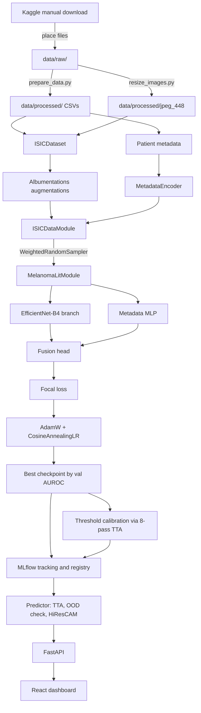
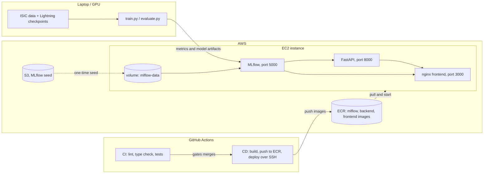

# Melanoma Detection, a Multimodal Classifier Trained and Shipped End to End

[](https://github.com/MuhammadNisarWCSS/Melanoma-Detection/actions/workflows/ci.yml)
[](https://python.org)
[](https://pytorch.org)
[](https://fastapi.tiangolo.com)
[](https://react.dev)
[](https://www.docker.com)
[](https://aws.amazon.com)
[](https://mlflow.org)
[](LICENSE)

This project implements a system that analyzes a dermoscopy photograph of a skin lesion in
conjunction with a patient's age, sex, and anatomical site to estimate the probability of
melanoma. The model is trained on the
[ISIC 2020](https://www.kaggle.com/competitions/siim-isic-melanoma-classification) dataset using
an EfficientNet-B4 image branch fused with a small patient-metadata network, tracked through
MLflow, served via FastAPI with test-time augmentation and an out-of-distribution check, presented
through a React dashboard, and deployed to AWS via GitHub Actions.

**Live demo** [melanomadetection.com](https://melanomadetection.com) · API docs at
[melanomadetection.com/api/docs](https://melanomadetection.com/api/docs) · experiment tracking at
[melanomadetection.com/mlflow](https://melanomadetection.com/mlflow/)

> This is a research and portfolio project, not a medical device. See
> [Model card and limitations](#model-card-and-limitations) before drawing any conclusions from it.

---

## Project rationale

Many portfolio machine learning projects stop at reporting a favorable metric. This project
instead documents a case where an initial result was found to be incorrect, diagnosed, corrected,
and then guarded against with automated tooling so the same failure cannot recur silently.

An early version of this pipeline reported a test AUROC of 0.9355. That figure was inaccurate. The
train/test split was performed per image rather than per patient, causing 1,656 of the 1,657
nominally "held-out" test images to share a patient with the training set. The model was
therefore not being evaluated on genuinely unseen data. It was, in part, recognizing skin it had
already encountered during training. After correcting the split to be patient-disjoint, the
honest test AUROC came out to 0.9069. A second, independent defect was also identified. The
training script was deploying the model's final training epoch rather than its best epoch, so the
live service was silently running weights that underperformed relative to the metrics being
reported. Both defects are representative of failures that appear correct in a demonstration but
fail silently in production. Both are now caught automatically. A CI test fails the build if any
patient ever appears in more than one split, and the training script reloads and verifies the
best checkpoint before it is deployed.

| | This project |
|---|---|
| Model | EfficientNet-B4 image branch plus a patient-metadata network, joined into one fusion head that outputs a single probability |
| Data splitting | Patient-grouped `StratifiedGroupKFold`, with a CI test that fails the build if any patient ID appears in more than one split |
| Class imbalance | A weighted sampler tuned to a specific oversampling rate, focal loss, and a threshold calibrated after training, not before |
| Inference | 8-pass test-time augmentation (image flips and rotations, averaged) reported alongside every prediction |
| Out-of-distribution check | Flags uploads that don't statistically resemble the training data, instead of confidently mislabeling them |
| Explainability | A HiResCAM heatmap returned with every prediction, showing what the model actually looked at |
| Experiment tracking | Every training run, its config, and its metrics logged to MLflow, with the best model registered automatically |
| Deployment | Docker Compose (nginx, FastAPI, MLflow) running on EC2, images built and pushed by GitHub Actions |

---

## How this was built

### 1. Two numbers that shaped almost every decision

The ISIC 2020 training set consists of 33,126 dermoscopy images from 2,056 patients, of which
only 584 images (1.76%) are malignant. These two characteristics, heavy clustering by patient and
extreme class imbalance, inform nearly every design decision described below.

The clustering is significant because a single patient typically contributes roughly a dozen
photographs of their own skin, often the same lesion captured from slightly different angles. A
split that treats each image as independent places nearly every patient on both sides of the
train/test boundary, allowing the model to score well by recognizing a patient's skin rather than
by recognizing melanoma. This is precisely the defect described above.

`scripts/prepare_data.py` splits with `StratifiedGroupKFold` grouped on `patient_id`, keeps that
ID in the output CSVs, and asserts the splits are patient-disjoint before writing anything to
disk.

| Split | Images | Malignant | Patients |
|---|---|---|---|
| train | 26,224 | 460 | 1,628 |
| val | 5,245 | 94 | 326 |
| test | 1,657 | 30 | 102 |

Kaggle's official test set is unlabeled and therefore unusable for evaluation. The held-out set
above is instead carved out of the labeled training data.

### 2. Why the model looks at more than the photo

Age, sex, and anatomical site are independently predictive of melanoma risk. A metadata-only
logistic regression exceeds random chance by a meaningful margin (see
[notebook 02](notebooks/02_metadata_analysis.ipynb)), which justified fusing this information into
the model rather than treating the task as a pure computer vision problem.

```
Dermoscopy image (384×384) ────► EfficientNet-B4 ──► 1792 numbers ─┐
                                                                    ├─► joined ─► Linear(512) ─► ReLU
Patient metadata (age, sex, site) ─► small MLP ──────► 32 numbers ─┘        └─► Dropout(0.5) ─► Linear(1)
```

`MetadataEncoder` (`src/cancer_detection/data/metadata.py`) converts those three fields into a
fixed 3-number vector with an explicit placeholder for missing values, so that a request missing
metadata degrades gracefully instead of failing.

The backbone is a configuration value rather than a hardcoded choice. `configs/model/` ships
EfficientNet-B0, B2, B4, and ResNet-50, selectable with `python scripts/train.py model=resnet50`.
EfficientNet-B4 at 384 pixels is the default, chosen as the best accuracy-to-throughput tradeoff
on a single GPU.

Raw ISIC photographs are as large as 6000 by 4000 pixels and require approximately 300
milliseconds of CPU time each to decode, which would starve a GPU if performed on every epoch.
`scripts/resize_images.py --size 448` builds a resized image cache once, and `configs/data/isic.yaml`
directs training at that cache rather than the raw files. The `num_workers: 0` setting is
deliberate rather than an oversight. Windows' process-spawning model deadlocked when the dataset
was pickled to worker processes.

### 3. Addressing a dataset that is 98% one class

At 1.76% prevalence, no single technique is sufficient on its own. Each of the following three
layers was introduced because a simpler configuration failed in a specific, identifiable way.

**Oversampling at a 15% rate, rather than 50/50.** A weighted sampler set to draw positives and
negatives evenly makes the model see each of the roughly 460 training positives about 28 times per
epoch, while leaving around 40% of negatives unseen entirely. The model memorizes the positive set
within the first epoch. Reducing the target draw rate to 15% preserves meaningful oversampling
(about 8.5 times) while still covering roughly 86% of negatives each epoch.

**Focal loss with alpha set to 0.5, rather than the conventional 0.25.** Alpha is a second
imbalance correction layered on top of a batch the sampler has already rebalanced. At 0.5, it is
neutral. At the more common 0.25 default (borrowed from RetinaNet, a substantially different
problem), it would bias the loss roughly 3 to 1 toward the negative class and push every predicted
probability toward zero.

**Threshold calibration after training, using the actual inference path.** `training/threshold.py`
reloads the exact weights that will be deployed, runs the validation set through the same 8-pass
test-time augmentation the live API uses, and selects the highest cutoff that still catches at
least 80% of melanomas. That value is written to `artifacts/threshold.json` and logged to MLflow.
Calibrating on raw single-pass logits, or on a checkpoint other than the one actually served, would
produce a threshold the deployed model does not honor in practice.

### 4. The audit that changed the design

The deployed service correctly classified images drawn from the training set, yet misclassified
genuine melanomas sourced from the web as benign. The following defects were identified during the
resulting audit.

**First defect, patient leakage.** `prepare_data.py` originally dropped `patient_id` entirely and
used a plain per-image train/test split. On those CSVs, 1,656 of 1,657 test images, including all
29 malignant ones, shared a patient with the training set. The 0.9355 AUROC that split produced
was never a genuine held-out measurement.

**Second defect, the wrong weights were deployed.** `scripts/train.py` called
`mlflow.pytorch.log_model()` on the model object left in memory after `fit()` completed, and
Lightning leaves the *final* epoch in memory, not the best one. The run in question peaked at
epoch 2 with a validation AUROC of 0.922 and a training AUROC of 0.983, then continued training to
epoch 7, where validation AUROC had dropped to 0.912 while training AUROC climbed to 0.995 (a
clear overfitting signature). The site was serving epoch 7's weights while the logged metrics
described epoch 2. `scripts/diagnose.py` quantified exactly how much that mattered on held-out
images at a fixed threshold.

| Model actually scored | Median malignant probability (test set) | Sensitivity | Specificity |
|---|---|---|---|
| Best checkpoint (epoch 2, val AUROC 0.922) | 0.351 | 0.966 | 0.750 |
| What was actually being served (epoch 7) | 0.201 | 0.759 | 0.850 |

**Third defect, "deterministic" test-time augmentation was not deterministic.** The rotation step
used `A.RandomRotate90(p=1.0)`, which still samples a random rotation count even at probability 1.
The same uploaded photo could therefore return a different score on every request, and the
reported uncertainty measure was effectively measuring that randomness rather than the model's
actual confidence.

**Fourth defect, image geometry did not match between training and serving.** ISIC photographs are
roughly 3 to 2. Validation and serving were both squashing them to a square with a plain resize,
while training used a random resized crop that preserves aspect ratio. That mismatch was invisible
in every metric computed at the time, because every metric was computed with the same defective
transform.

Each of these defects is now enforced in code rather than corrected as a one-time fix.

| Defect | Fix | Where it is enforced |
|---|---|---|
| Patient leakage | `StratifiedGroupKFold` on `patient_id`, with a disjointness check at split time | `scripts/prepare_data.py`, `tests/unit/test_patient_leakage.py` (fails CI) |
| Wrong weights deployed | Reload the best checkpoint into a fresh model before logging it, and calibrate the threshold on those exact weights | `scripts/train.py`, `training/threshold.py` |
| Non-reproducible augmentation | Fixed rotation lambdas for all 8 dihedral views instead of a random sampler | `data/transforms.py` |
| Squashed image geometry | The same crop-to-square transform used everywhere: validation, augmentation, and serving | `data/transforms.py` |
| Overly soft probabilities | Focal loss alpha set to 0.5 | `configs/training/default.yaml` |
| Brittleness on real-world photos | JPEG compression, downscaling, and blur added to training augmentation, plus the out-of-distribution gate at serve time | `data/transforms.py`, `serving/ood.py` |

`scripts/diagnose.py` remains in the repository as a standing check. It scores training images
(establishing a memorization ceiling), held-out test images, those same test images re-encoded to
resemble web-sourced photographs, and any additional files provided. On the current model, images
degraded to resemble web-sourced photographs score close to clean test images, indicating that the
specific brittleness which originally motivated the compression augmentation no longer manifests.
The gap between training and test scores remains large by design, precisely the gap that a leaked
split would have concealed.

### 5. From checkpoint to prediction

- **Test-time augmentation.** Eight dihedral symmetries of the image are scored and averaged, and
  the spread across those eight scores is returned as `tta_std`. The first of the eight passes is
  the original, unmodified image, so the explainability step below reuses that pass instead of
  running a ninth forward pass solely for the heatmap.
- **Out-of-distribution gate.** This model is a dermoscopy classifier, not a general skin photo
  classifier. `serving/ood.py` keeps a cached set of feature embeddings from training images,
  reduces them with PCA, and flags any upload whose embedding falls past the 99th percentile of
  distance from that cluster. That percentile is calibrated on a held-out slice of the sample.
  Fitting it on the same data used to build the cluster would make normal training images appear
  artificially close and trip real, unusual inputs far more often than the intended 1%.
- **HiResCAM instead of GradCAM.** GradCAM averages gradients globally, which produced heatmaps
  that did not actually track the lesion in this model. HiResCAM keeps the gradients spatial. The
  target layer is EfficientNet's `bn2` rather than its final layer, because the final layer's
  border cells produced a systematic artifact in the top-right corner of every heatmap.
- **Fail visibly, not silently.** The model loads on a background thread at startup instead of
  blocking FastAPI's lifespan (a blocking load was causing Docker healthchecks to fail). `/health`
  stays at 200 with `model_loaded: false` while that is happening, and prediction endpoints return
  503 until the model is actually ready.

### How each number in a prediction is actually calculated

Everything here happens inside `Predictor.predict` for one uploaded photo.

**The probability.** The photo is cropped to a square and resized to 384 by 384 pixels. Age, sex,
and site are encoded into a 3-number vector. The image passes through EfficientNet-B4 to produce
1,792 numbers describing what it sees, the metadata passes through a small network to produce 32
numbers, and the fusion layer combines both into a single score, which a sigmoid converts to a
value between 0 and 1. That process runs 8 times on flipped and rotated copies of the same photo,
and the 8 results are averaged into the probability shown on the gauge. It is a ranking score, not
a literal percentage likelihood of cancer. Focal loss and oversampling shift the raw values, and
the test-set calibration error (ECE) is 0.072.

**The cutoff.** A photo is labeled malignant if its probability is at or above the threshold,
currently 0.2348. That value came from testing many possible cutoffs on the validation set and
selecting the lowest one that still caught at least 80% of melanomas, using the same 8-pass
averaging the live API uses. It sits well below 0.5 deliberately, since missing a melanoma is
considered far more costly than an unnecessary false positive.

**Confidence (still in the API, no longer shown on the site).** This is the distance from the
probability to the cutoff, scaled to a 0 to 1 range. It is not a probability of being correct, and
it is asymmetric. With a threshold of 0.2348, a benign result can never score above about 0.31,
while a malignant one can reach 1.0. The field remains in the API response for anyone building on
it, but the dashboard no longer displays it, because a figure such as "33% confidence" implies a
meaning the metric does not actually carry.

**View agreement (`tta_std`).** The spread across the 8 augmented views. If flipping or rotating a
photo produces very different scores, the model is reacting to orientation rather than the lesion
itself, which is a sign the prediction is unstable. The dashboard shows this in a collapsed details
panel and flags it above roughly 0.10, a judgment call rather than a formally calibrated cutoff.

**The out-of-distribution flag.** The unaugmented view's feature embedding is compared against a
cluster of training-image embeddings, and anything past the 99th percentile of distance from that
cluster is flagged as unreliable.

**The heatmap.** The model runs once more on the base view with gradients enabled. At the last
convolutional layer, each region's activation is weighted by how much it pushed the score toward
the predicted class, summed, and any negative contribution is discarded. The result highlights
what the model responded to, upsampled and overlaid on the original photo. It shows what
influenced the score, not where disease is physically located, and it is computed from a single
view.

---

## Results

Every number below comes from actually running `python scripts/evaluate.py` against the
patient-disjoint test split (1,657 images, 30 malignant, 1.81% prevalence) at the calibrated
threshold of 0.2348. Confidence intervals are bootstrapped.

| Metric | Value | 95% confidence interval |
|---|---|---|
| Test AUROC | 0.9069 | 0.863 to 0.949 |
| Test partial AUC | 0.6908 | 0.566 to 0.862 |
| Sensitivity | 0.767 (23 of 30) | 0.600 to 0.900 |
| Specificity | 0.905 | 0.891 to 0.919 |
| Positive predictive value | 0.129 | not computed |
| Negative predictive value | 0.995 | not computed |
| F1 | 0.221 | not computed |
| Expected calibration error | 0.072 | not computed |
| Validation AUROC (used for model selection) | 0.9252 | not computed |

**Before and after the leakage fix**, for comparison. The drop is the correct outcome, not a
regression.

| Split construction | Test AUROC | Sensitivity | Specificity |
|---|---|---|---|
| Per-image split, patients shared across sets | 0.9355 | 0.966 | 0.785 |
| Patient-grouped split (current) | 0.9069 | 0.767 | 0.905 |

Two caveats are worth stating explicitly. Positive predictive value is only 0.129. At 1.8%
prevalence, with a threshold tuned for sensitivity, 155 of the 178 photos flagged as malignant are
false positives. This is the deliberate cost of prioritizing sensitivity, not a flaw being
concealed. With only 30 positive cases in the test set, every confidence interval above is
correspondingly wide. Sensitivity alone could plausibly fall anywhere between 0.60 and 0.90 on a
different random sample of the same size.

For context, the top solutions on the original ISIC 2020 Kaggle leaderboard score approximately
0.94 to 0.96 AUC using ensembles of larger models at higher resolution with additional external
data. This project prioritizes a single, honestly measured model over pursuing a
leaderboard-competitive score.

### Interactive threshold exploration

The dashboard includes an interactive control that recomputes sensitivity, specificity, PPV, NPV,
and the false-positive and false-negative counts at any candidate threshold, letting a viewer see
the sensitivity/specificity trade-off directly rather than only at the single deployed operating
point. The underlying sweep (`threshold_sweep()` in
`src/cancer_detection/evaluation/metrics.py`) merges the exact calibrated threshold into its
otherwise evenly spaced grid of candidate cutoffs, so the control lands precisely on the deployed
threshold instead of snapping to the nearest sampled value.

### How it performs across different groups of patients

`python scripts/subgroup_analysis.py` splits the test predictions by sex, age, and body site.
These subgroups are small. The results below should be read as indicating where the model has not
been proven, rather than as a precise estimate of real-world performance.

| Subgroup | Images | Malignant | Sensitivity | Specificity | AUROC |
|---|---|---|---|---|---|
| Female | 833 | 12 | 0.67 | 0.93 | 0.87 |
| Male | 824 | 18 | 0.83 | 0.88 | 0.93 |
| Age under 40 | 429 | 5 | 0.40 | 0.94 | 0.74 |
| Age 40 to 59 | 941 | 7 | 0.71 | 0.92 | 0.94 |
| Age 60 and over | 287 | 18 | 0.89 | 0.80 | 0.89 |
| Lower extremity | 446 | 5 | 0.40 | 0.91 | 0.73 |
| Torso | 818 | 8 | 0.75 | 0.91 | 0.94 |
| Upper extremity | 244 | 11 | 0.91 | 0.85 | 0.91 |
| Head or neck | 87 | 6 | 0.83 | 0.91 | 0.96 |

The weakest spots are younger patients and lower-limb lesions, where the model catches only 2 of 5
malignant cases in each group. Older patients get the best sensitivity but the worst specificity,
which is consistent with a model that is partly relying on age as a signal. Palms, soles, and the
oral or genital area have zero malignant cases in the test set, so the model is genuinely untested
there.

---

## Architecture


```mermaid
flowchart TD
    Kaggle[Kaggle manual download] -->|place files| RawData[data/raw/]
    RawData -->|prepare_data.py| SplitCSVs[data/processed/ CSVs]
    RawData -->|resize_images.py| Cache[data/processed/jpeg_448]
    SplitCSVs --> Dataset[ISICDataset]
    Cache --> Dataset
    SplitCSVs --> MetaCSV[Patient metadata]
    Dataset --> Transforms[Albumentations augmentations]
    MetaCSV --> MetaEncoder[MetadataEncoder]
    Transforms --> DataModule[ISICDataModule]
    MetaEncoder --> DataModule
    DataModule -->|WeightedRandomSampler| LitModel[MelanomaLitModule]
    LitModel --> ImgBranch[EfficientNet-B4 branch]
    LitModel --> MetaBranch[Metadata MLP]
    ImgBranch --> Fusion[Fusion head]
    MetaBranch --> Fusion
    Fusion --> FocalLoss[Focal loss]
    FocalLoss --> Optimizer[AdamW + CosineAnnealingLR]
    Optimizer --> Ckpt[Best checkpoint by val AUROC]
    Ckpt --> Calib[Threshold calibration via 8-pass TTA]
    Ckpt --> MLflow[MLflow tracking and registry]
    Calib --> MLflow
    MLflow --> Predictor[Predictor: TTA, OOD check, HiResCAM]
    Predictor --> FastAPI[FastAPI]
    FastAPI --> UI[React dashboard]
```

**Config flow.** `configs/config.yaml` composes the data, model, and training configs with Hydra.
No hyperparameters are hardcoded. `scripts/train.py` takes its entire configuration from this
tree, and `scripts/evaluate.py` recomposes the same tree so evaluation cannot silently drift from
how the model was trained.

**The contract between training and serving.** Training logs the model artifact under a fixed
name, registers it in the MLflow model registry, and logs its validation AUROC as a specific
metric key. `serving/model_uri.resolve_model_uri()` reads, in order, an explicit environment
variable override, then falls back to the finished run with the highest validation AUROC that has
a logged model. Renaming either the artifact or the metric key would silently break that
resolution, so both are treated as fixed points in the design.

**The API surface.** A health check that reports whether a model is loaded, a metadata endpoint
describing accepted input values, a test-metrics endpoint that feeds the dashboard, and a predict
endpoint that takes an image plus patient fields and returns a probability. nginx proxies API and
MLflow traffic under the same origin as the site, so the browser only ever talks to one port.

---

## Technology stack

**Modeling.** PyTorch with PyTorch Lightning for the training loop (checkpointing, early stopping,
mixed precision), timm for pretrained backbones, and torchmetrics for the standard metrics plus a
custom implementation of partial AUC and calibration error. Albumentations handles augmentation
because the geometry decisions above require transform-level control that a simpler pipeline made
cumbersome.

**Configuration and tracking.** Hydra and OmegaConf provide composable YAML configs with
command-line overrides and multi-run sweeps, so there are no hardcoded hyperparameters anywhere in
the training code. MLflow provides experiment tracking, the model registry, and artifact storage,
and is the shared interface between the training environment and the deployed server.

**Serving.** FastAPI with Pydantic for validation and Uvicorn as the server. The explainability
step uses a HiResCAM implementation built on PyTorch hooks. Out-of-distribution detection is a
small, dependency-free NumPy implementation rather than pulling in SciPy for a single calculation.

**Frontend.** React, TypeScript, Vite, and Tailwind, with framer-motion for animation. The
frontend communicates with FastAPI for predictions and reads run history directly from MLflow's
REST API, so the dashboard always reflects actual experiment history rather than a hardcoded table
someone forgot to update.

**Infrastructure.** Docker Compose with environment-specific overlays, nginx as the static file
host and reverse proxy, AWS EC2, ECR, and S3, and GitHub Actions for both quality gates and
deployment. Code quality is enforced with ruff, mypy, and pytest with coverage reporting.

| Layer | Technologies |
|---|---|
| Languages | Python 3.11, TypeScript, Shell |
| Deep learning | PyTorch, Lightning, timm (EfficientNet-B0/B2/B4, ResNet-50) |
| Data and augmentation | Albumentations, NumPy, Pandas, Pillow, OpenCV, scikit-learn |
| Metrics | torchmetrics, a custom partial AUC and calibration error implementation |
| Configuration | Hydra, OmegaConf |
| Experiment tracking | MLflow (tracking, registry, artifact store) |
| Explainability | pytorch-grad-cam (HiResCAM) |
| Backend | FastAPI, Pydantic, Uvicorn |
| Frontend | React, Vite, TypeScript, Tailwind, framer-motion |
| Reverse proxy | nginx |
| Containers | Docker, Docker Compose (with overlays for local, ECR, EC2, and seeding) |
| Cloud | AWS EC2, ECR, S3, IAM |
| CI/CD | GitHub Actions |
| Code quality | ruff, mypy, pytest, coverage reporting via Codecov |

---

## Running it yourself

```bash
# install
git clone https://github.com/MuhammadNisarWCSS/Melanoma-Detection.git
cd Melanoma-Detection
python -m venv .venv && source .venv/bin/activate   # Windows: .venv\Scripts\activate
pip install -e ".[dev]"

# get the data: accept the rules on the ISIC 2020 Kaggle page, download train.csv
# and jpeg.zip into data/raw/, then build the patient-grouped splits and image cache
python scripts/prepare_data.py
python scripts/resize_images.py --size 448

# train (fast_dev is a <60s CPU smoke test, run it first)
python scripts/train.py training=fast_dev
python scripts/train.py                              # full run, needs a GPU

# evaluate the best checkpoint on the untouched, patient-disjoint test split
python scripts/evaluate.py

# serve it locally
uvicorn cancer_detection.serving.api:app --host 0.0.0.0 --port 8000 --reload
cd frontend && npm install && npm run dev             # http://localhost:3000

# run the test suite (synthetic fixtures, no download or trained model needed)
pytest tests/unit tests/integration -v
```

Full details on config overrides, sweeps, checkpoint selection, and the MLflow model-resolution
contract are in [CLAUDE.md](CLAUDE.md).

---

## Deployment

### Docker Compose

```bash
docker compose --project-directory . -f docker/docker-compose.yml up --build
```

Three containers run, the site on port 3000, the API on port 8000, and MLflow on port 5000, with
nginx proxying everything so the browser only needs to talk to one port. Environment-specific
overlays layer on top of the same base file for pulling prebuilt images from ECR, running
persistently on EC2, seeding MLflow history on first boot, or pointing at a local MLflow database
for debugging.

### AWS


```mermaid
flowchart LR
    subgraph Laptop["Laptop / GPU"]
        Train[train.py / evaluate.py]
        Data[ISIC data + Lightning checkpoints]
    end
    subgraph AWS["AWS"]
        S3[(S3, MLflow seed)]
        ECR[(ECR: mlflow, backend, frontend images)]
        subgraph EC2["EC2 instance"]
            FE[nginx frontend, port 3000]
            BACKEND[FastAPI, port 8000]
            ML[MLflow, port 5000]
            Vol[(volume: mlflow-data)]
        end
    end
    subgraph GHA["GitHub Actions"]
        CI[CI: lint, type check, tests]
        CD[CD: build, push to ECR, deploy over SSH]
    end
    Data --> Train
    Train -->|metrics and model artifacts| ML
    S3 -.->|one-time seed| Vol
    Vol --> ML
    ML --> BACKEND
    BACKEND --> FE
    ML --> FE
    CD -->|push images| ECR
    ECR -->|pull and start| EC2
    CI -->|gates merges| CD
```

GPU training is performed on a local workstation. EC2 handles only CPU inference and tracking.
This is a deliberate architectural choice rather than a limitation. It mirrors how production ML
teams typically separate training from serving, and it keeps cloud costs proportional to serving
traffic rather than to training compute.

- **EC2** runs the entire stack on a single instance. The security group needs to allow inbound
  traffic on ports 3000, 5000, and 8000 (5000 is needed so training on the laptop can reach the
  tracking server).
- **ECR** holds three private images, `mlflow`, `backend`, and `frontend`, each tagged with the
  git commit SHA and `latest`. EC2 pulls prebuilt images rather than building on the server, so
  deploys are immutable and repeatable instead of a `git pull` on a live box.
- **S3** carries a one-time export of local MLflow history via `scripts/prepare_mlflow_seed.py`.
  The first boot syncs that into a named Docker volume, and every later deploy keeps that same
  volume in place.
- **GitHub secrets** the deploy workflow needs are AWS credentials, the AWS region, the EC2 host and
  SSH user and key, and the S3 URI for the MLflow seed.

Once an improved training run finishes, the dashboard's metrics update immediately, since they are
read live from MLflow. Predictions still use whatever model was loaded when the backend started,
however, so the backend needs a restart to pick up a newly promoted best model.

> The public IP address for this deployment appears in about eight different places across the
> codebase (serving config, frontend config, deploy scripts) because there is no reserved Elastic
> IP attached to it. They all need to move together if that ever changes.

### CI/CD

CI runs on every push and pull request to `main`. It installs PyTorch, runs the linter and formatter
check, runs the type checker, runs the unit tests with coverage, runs integration tests against a
real FastAPI test client, then uploads coverage.

CD runs on pushes to `main` that touch the app code, or can be triggered manually. It builds all
three Docker images, tags and pushes them to ECR, copies the compose files to EC2 over SSH, pulls
the new images there, seeds MLflow history from S3 if the volume is empty, brings the stack up,
and polls all three services until they report healthy.

---

## Model card and limitations

| | |
|---|---|
| Intended use | A research and portfolio demonstration of an end-to-end machine learning system. It is not a medical device and is not meant for diagnosis, triage, or any clinical decision. |
| Training data | The ISIC 2020 training set only: dermoscopy images, 1.76% malignant. Skin tones and imaging equipment reflect that dataset's contributor mix and are not globally representative. |
| Out of scope | Ordinary phone photos, screenshots, histopathology slides, and skin cancers other than melanoma as a primary task. |
| Operating point | The threshold is 0.235, chosen to reach at least 80% sensitivity on validation data. On the test set that comes out to 76.7% sensitivity, 90.5% specificity, and a positive predictive value of just 12.9%, meaning 155 false positives for every 23 real cancers caught. A "benign" result from this model is not a clean bill of health. |
| Known failure modes | Heavily compressed or low-resolution images, photos with rulers, watermarks, or heavy hair unlike the training data, and anything the out-of-distribution detector flags. |
| Subgroup gaps | Sensitivity drops to 40% for patients under 40 and for lesions on the lower legs (5 malignant cases in each group), and there is no test coverage at all for palms, soles, or the oral or genital area. See [subgroup performance](#how-it-performs-across-different-groups-of-patients). |
| Calibration | The calibration error on the test set is 0.072. Treat the output as a ranking score, not as a literal probability of malignancy. |
| Human oversight | Any real use requires a qualified clinician. The heatmap is an explanation aid, not a way to localize disease. |

---

## Project structure

```
CancerDetection/
├── configs/                        # Hydra config tree, zero hardcoded hyperparameters
│   ├── config.yaml                 # composes data + model + training
│   ├── data/isic.yaml
│   ├── model/{efficientnet_b0,b2,b4,resnet50}.yaml
│   └── training/{default,fast_dev}.yaml
├── data/
│   ├── raw/                        # gitignored, Kaggle downloads go here
│   └── processed/                  # split CSVs and the resized image cache
├── notebooks/                      # exploratory analysis, metadata analysis, training curves, saliency
├── src/cancer_detection/
│   ├── data/                       # dataset, datamodule, transforms, metadata encoder
│   ├── models/                     # backbone factory, the fusion classifier
│   ├── training/                   # the Lightning module, focal loss, threshold calibration, callbacks
│   ├── evaluation/                 # AUROC, partial AUC, calibration error, reliability diagrams, threshold sweep
│   ├── explainability/             # the HiResCAM wrapper
│   ├── serving/                    # FastAPI app, Predictor, out-of-distribution detector, model URI resolution
│   └── utils/                      # logging setup, seeding
├── scripts/
│   ├── prepare_data.py             # patient-grouped splits
│   ├── resize_images.py            # builds the training image cache
│   ├── train.py                    # training entrypoint, logs the best checkpoint
│   ├── evaluate.py                 # held-out test evaluation
│   ├── diagnose.py                 # the train/test/degraded/web drift audit
│   ├── republish_checkpoint.py     # re-log a checkpoint as the deployed model
│   └── prepare_mlflow_seed.py      # package local MLflow history for S3
├── tests/
│   ├── unit/                       # transforms, metadata, metrics, OOD detection, the patient-leakage regression test
│   └── integration/                # a training smoke test and FastAPI client flows
├── frontend/                       # React + Vite + Tailwind dashboard
├── docker/                         # backend and MLflow images, the base compose file plus overlays
├── artifacts/                      # threshold.json, test_metrics.json, diagnostic outputs
└── .github/workflows/              # ci.yml, deploy.yml
```

---

## License

MIT. See [LICENSE](LICENSE).
